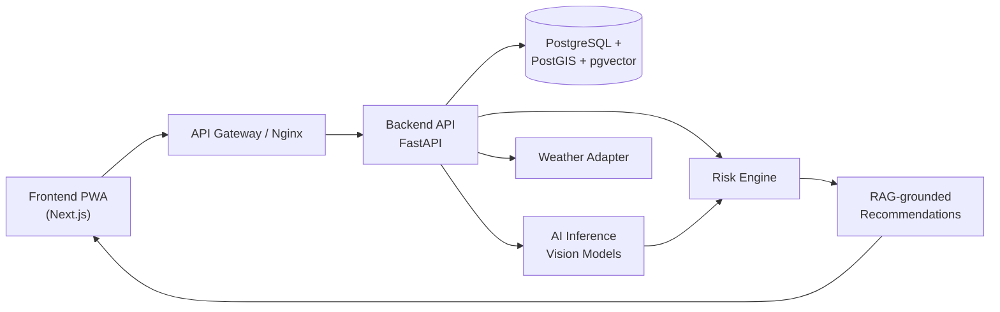

# 🌿 FasalRakshak
### Scan. Predict. Protect.

**AI-Powered Crop Health, Disease Detection & Early Warning Platform**

> Smart India Hackathon 2026 · Problem Statement **SIH26131** — *Early detection and management of crop diseases and pest infestations* · Theme: **Agriculture, FoodTech & Rural Development** · Category: **Software**

> 📌 **Current phase: Architecture & Documentation.** This repository contains the complete technical blueprint. Implementation starts after blueprint sign-off (see `docs/00`, §48 Development Phases). **No application code is committed yet — by design.**

---

## What is FasalRakshak?

FasalRakshak is **not** an "upload photo → disease name" classifier. It is an agricultural **decision-support and early-warning platform** built on one core principle:

> **Evidence > Guess.**

When visual evidence is weak, the system says so — and asks targeted follow-up questions instead of forcing a label. Every diagnosis is delivered with a confidence score, an explanation of *why*, a 3/7/14-day risk outlook, and a safe, source-grounded, multilingual advisory. Confirmed cases flow into a human-in-the-loop validation layer and a GIS surveillance layer for agriculture officers.

### The Three Answers (why we are different)

| Quantity | Question it answers |
|---|---|
| **Diagnosis Confidence** | How sure is the AI about what it sees? |
| **Disease/Pest Risk** | How likely is this problem to be real and significant *right now*, given weather, crop stage, location and history? |
| **Escalation Risk (3/7/14 days)** | How is this likely to evolve — should the farmer act now or watch closely? |

## Core Product Flow

```
Farmer → Crop/Leaf Image → Image Quality Check → AI Vision Analysis → Confidence
      → Adaptive Questions (if needed) → Context Fusion (weather + crop stage + location + field data)
      → Disease/Pest Risk Engine → 3/7/14 Day Risk → Evidence-Based Advisory
      → Farmer Action → Expert Validation (optional) → Feedback Loop → Regional/GIS Intelligence
```

## Architecture at a Glance



## MVP Scope (smallest complete system)

Farmer login · farm/field creation · crop selection · image upload · image quality check · AI disease classification with confidence · adaptive questions · risk score · recommendation · scan history · basic weather integration · basic officer dashboard · basic GIS map.

Advanced (marked, **not** required for MVP): pest YOLO detection, XGBoost learned risk, expert validation console, hotspot clustering, push/SMS channels, IoT/soil sensors, satellite/drone imagery, edge AI. See `docs/19_Future_Roadmap.md`.

## Repository Structure (planned)

```
fasalrakshak/
├── frontend/     # Next.js PWA (farmer, expert, officer UIs)
├── backend/      # FastAPI app (API, risk engine, GIS, RAG, weather)
├── ai/           # Model training, evaluation, export pipelines
├── models/       # Versioned model artifacts (registry manifest)
├── data/         # Dataset manifests, labeling guides (no raw data in git)
├── docs/         # 22 numbered documents + master blueprint
├── scripts/      # Dev/bootstrap utilities
├── tests/        # Cross-cutting E2E tests
├── docker/       # Dockerfiles, nginx config, compose assets
├── .github/      # CI workflows
├── docker-compose.yml
└── README.md
```

## Documentation Index

| # | Document | # | Document |
|---|---|---|---|
| 00 | [Complete Architecture Blueprint](docs/00_Complete_Architecture_Blueprint.md) | 12 | [Security Architecture](docs/12_Security_Architecture.md) |
| 01 | [Project Overview](docs/01_Project_Overview.md) | 13 | [User Flows](docs/13_User_Flows.md) |
| 02 | [Problem Statement](docs/02_Problem_Statement.md) | 14 | [UI/UX Specification](docs/14_UI_UX_Specification.md) |
| 03 | [Product Requirements](docs/03_Product_Requirements.md) | 15 | [Deployment Guide](docs/15_Deployment_Guide.md) |
| 04 | [System Architecture](docs/04_System_Architecture.md) | 16 | [Testing Strategy](docs/16_Testing_Strategy.md) |
| 05 | [Technical Architecture](docs/05_Technical_Architecture.md) | 17 | [Model Evaluation](docs/17_Model_Evaluation.md) |
| 06 | [AI/ML Architecture](docs/06_AI_ML_Architecture.md) | 18 | [Data Strategy](docs/18_Data_Strategy.md) |
| 07 | [Database Design](docs/07_Database_Design.md) | 19 | [Future Roadmap](docs/19_Future_Roadmap.md) |
| 08 | [API Documentation](docs/08_API_Documentation.md) | 20 | [SIH Demo Strategy](docs/20_SIH_Demo_Strategy.md) |
| 09 | [GIS Architecture](docs/09_GIS_Architecture.md) | 21 | [FAQ for Judges](docs/21_FAQ_For_Judges.md) |
| 10 | [Risk Engine](docs/10_Risk_Engine.md) | 22 | [Research References](docs/22_Research_References.md) |
| 11 | [RAG Knowledge System](docs/11_RAG_Knowledge_System.md) | | |

## Tech Stack (justified in `docs/00` §53)

Frontend: **Next.js + TypeScript + Tailwind CSS + PWA + next-intl + react-leaflet** · Backend: **Python + FastAPI** · Database: **PostgreSQL + PostGIS + pgvector** · AI: **PyTorch (CPU-first)** — MobileNetV3/EfficientNet-Lite0 classifiers, YOLO nano pest detector, XGBoost risk model · Infra: **Docker Compose + Nginx + GitHub Actions**.

## Safety Disclaimer

FasalRakshak is a **decision-support** tool. It does not replace expert, KVK, or agriculture-officer advice. Recommendations are generated only from government/university/ICAR-sourced knowledge with citations, and the system explicitly supports **"Insufficient Evidence — expert verification recommended."** It does **not** auto-prescribe pesticides.

## License

MIT (proposed) — see `LICENSE` when implementation phase begins.
