# FasalRakshak
## Complete Project Architecture & Technical Blueprint

| Field | Value |
|---|---|
| Product | **FasalRakshak** |
| Tagline | Scan. Predict. Protect. |
| Category | AI-Powered Crop Health, Disease Detection & Early Warning Platform |
| Program | Smart India Hackathon 2026 |
| Problem Statement | **SIH26131** — Early detection and management of crop diseases and pest infestations |
| Theme | Agriculture, FoodTech & Rural Development · Category: Software |
| Document Status | Architecture Phase — v1.0 |
| Companion Docs | `docs/01` … `docs/22` (see §47) |

### Source-Discipline Legend
- **[SOURCE-DERIVED]** — from the approved SIH concept brief / original proposal (SIH26131, Chain-of-Inquiry, PlantInquiryVQA, NPSS, IPM framing). Preserved unchanged.
- **[ARCHITECT INFERENCE]** — standard engineering practice derived from the brief (e.g., FastAPI, PostGIS).
- **[PROPOSED DESIGN]** — FasalRakshak-specific decisions made in this blueprint; subject to team review.
- **[FUTURE FEATURE]** — explicitly *not* part of MVP/SIH demo.
- **[EXTERNAL RESEARCH]** — cites published work; see `docs/22_Research_References.md`.

> ⚠️ The original concept PDF was not present in the workspace at authoring time. All [SOURCE-DERIVED] content is aligned to the approved written brief. When the concept document is committed under `docs/_source/`, reconcile deltas against this blueprint.

### Table of Contents
1. Executive Summary · 2. Problem Definition · 3. Product Vision · 4. Target Users · 5. User Personas · 6. Core Use Cases · 7. Functional Requirements · 8. Non-Functional Requirements · 9. Product Modules · 10. User Journey · 11. System Architecture · 12. Detailed Data Flow · 13. Frontend Architecture · 14. Backend Architecture · 15. AI/ML Architecture · 16. Image Quality Engine · 17. Adaptive Question Engine · 18. Multimodal Context Fusion · 19. Risk Engine · 20. Weather Intelligence · 21. GIS Intelligence · 22. RAG Architecture · 23. Recommendation Engine · 24. Expert Validation · 25. Officer Dashboard · 26. Notification System · 27. Database Architecture · 28. ER Diagram Description · 29. API Architecture · 30. Security Architecture · 31. Privacy Architecture · 32. Low Connectivity Architecture · 33. Deployment Architecture · 34. Monitoring & Observability · 35. Dataset Strategy · 36. Model Training Strategy · 37. Model Evaluation · 38. Testing Strategy · 39. Error Handling · 40. Scalability · 41. Sustainability · 42. MVP · 43. SIH Prototype · 44. Advanced Features · 45. Future Roadmap · 46. Project Folder Structure · 47. Documentation Structure · 48. Development Phases · 49. Team Responsibilities · 50. Risk Register · 51. SIH Demo Story · 52. Judge Questions · 53. Technical Justification · 54. Research References · 55. Final Architecture Summary

---

## 1. Executive Summary

FasalRakshak ("Scan. Predict. Protect.") is an AI-powered crop health, disease detection and early-warning platform for SIH 2026 problem statement **SIH26131** [SOURCE-DERIVED].

Most plant-disease apps answer one question: *"What disease is this photo?"* That single-shot answer fails in real fields: photos are blurry, diseases look alike, and a label tells the farmer nothing about what to do — or what happens next week.

FasalRakshak is designed around **Evidence > Guess** [PROPOSED DESIGN]:

1. **It never forces a diagnosis.** When visual evidence is weak it returns **"Insufficient Evidence"** and asks a small set of *adaptive, targeted questions*, inspired by the Chain-of-Inquiry framework [SOURCE-DERIVED; External Research R1].
2. **It separates three quantities** — Diagnosis Confidence, Disease/Pest Risk, and Escalation Risk (3/7/14 days) [PROPOSED DESIGN].
3. **It fuses multimodal context** — image evidence + farmer answers + weather + crop stage + location + field history + regional signals [SOURCE-DERIVED].
4. **It closes the loop**: farmer → expert validation → officer intelligence → feedback → better models [SOURCE-DERIVED].
5. **It is farmer-first**: multilingual (en/hi/Hinglish, extensible) and a PWA with offline queueing for rural connectivity [PROPOSED DESIGN].

Scope: full system architecture, AI/ML design, database, API, security, deployment, testing, MVP definition, SIH demo strategy — detailed enough that any developer can build FasalRakshak without guessing.

## 2. Problem Definition

### 2.1 Original Problem Statement [SOURCE-DERIVED]
**SIH26131 — Early detection and management of crop diseases and pest infestations.**
Theme: Agriculture, FoodTech & Rural Development · Category: Software.

### 2.2 Why the problem is hard

| Field challenge | Consequence | FasalRakshak response |
|---|---|---|
| Symptoms noticed late | Damage done; control costs rise | Scan-first UX + proactive alerts |
| Look-alike symptoms (deficiency vs. fungal vs. viral) | Wrong treatment, wasted spend | Multi-hypothesis differential + adaptive questions |
| Poor field photos (blur, glare, occlusion) | Garbage AI output | Mandatory image-quality gate |
| Expert scarcity (one KVK/officer per many villages) | Delayed advice | Triage: AI handles routine, experts handle hard cases |
| Language/literacy barriers | Advice not understood or trusted | Multilingual advisory, simple actions, icons |
| Poor connectivity | App unusable in field | PWA + offline queue + compressed uploads |
| Guessing → pesticide overuse | Cost, residues, resistance | Evidence-grounded, IPM-first recommendations |

### 2.3 What "early" actually requires
Early detection = (a) detection while intervention is still cheap, (b) forecasting evolution, (c) an actionable localized advisory, and (d) a surveillance signal for officers. A classifier alone provides only (a) — and unreliably. Hence a **platform**, not a classifier [ARCHITECT INFERENCE].

## 3. Product Vision

**Core principle: Evidence > Guess.**

FasalRakshak answers ten questions [SOURCE-DERIVED]: (1) What is happening to the crop? (2) How confident are we? (3) Why does the system believe this? (4) What additional information is needed? (5) What is the current disease/pest risk? (6) What could happen in the next 3/7/14 days? (7) Where are similar risks occurring? (8) What should the farmer do? (9) When should an expert or agriculture officer be involved? (10) How can confirmed field observations improve future intelligence?

Core product flow [SOURCE-DERIVED]:

```
Farmer → Crop/Leaf Image → Image Quality Check → AI Vision Analysis → Confidence Evaluation
      → Adaptive Questions (if required) → Context Fusion (Weather + Crop Stage + Location + Field Data)
      → Disease/Pest Risk Engine → 3/7/14 Day Risk → Evidence-Based Advisory
      → Farmer Action → Optional Expert Validation → Feedback Loop → Regional/GIS Intelligence
```

The product must feel like **"an intelligent agricultural early-warning assistant"**, not "just another plant disease classifier" [SOURCE-DERIVED].

## 4. Target Users

| Role | Primary goal | Primary surface |
|---|---|---|
| **Farmer** | Scan crop, get trustworthy diagnosis + risk + action | Farmer PWA (mobile-first) |
| **Agriculture Extension Worker** | Triage village cases; assist low-literacy farmers | Farmer PWA + case views |
| **Agricultural Expert** | Validate/correct AI diagnoses on hard cases | Expert console |
| **District Agriculture Officer** | District situation, hotspots, verified outbreaks | Officer dashboard |
| **Administrator** | Users, knowledge base, models, configuration | Admin console |

## 5. User Personas [PROPOSED DESIGN]

- **P1 · Ramesh (Farmer, 45)** — 2 ha mixed tomato + cotton; Hindi-first; basic Android, 2 GB/day data; cost-sensitive about sprays. Needs: photo → honest answer → simple action, in Hindi, on a weak network.
- **P2 · Sunita (Extension Worker)** — covers 8 villages; needs a triage list of fields needing visits and a UI she can operate *with* the farmer on one phone.
- **P3 · Dr. Verma (Expert, KVK)** — ~20 min/day for review; needs a case queue ordered by urgency with image + AI hypothesis + confidence + farmer answers + weather/context; one-tap confirm/correct.
- **P4 · Officer Shukla (District Agriculture Officer)** — needs a district map separating **AI-predicted risk** vs **farmer-reported** vs **expert-verified** cases; escalates interventions, files inspection reports.
- **P5 · Admin** — onboards users, manages knowledge base, model versions, regional config, system health.

## 6. Core Use Cases

| ID | Use case | Actor | Priority |
|---|---|---|---|
| UC-01 | Register account, farm, fields (GPS), crops & crop stage | Farmer | MVP |
| UC-02 | Crop scan: capture/upload image → quality gate | Farmer | MVP |
| UC-03 | Retake guidance when image unusable | Farmer | MVP |
| UC-04 | Sufficient-evidence diagnosis + explanation + risk + advisory | Farmer | MVP |
| UC-05 | Insufficient-evidence → adaptive Q&A → fused diagnosis | Farmer | MVP |
| UC-06 | View 3/7/14-day risk for a field | Farmer | MVP |
| UC-07 | Receive alert (high risk / weather window) | Farmer | MVP |
| UC-08 | Request expert review; expert validates/corrects | Farmer, Expert | SIH DEMO |
| UC-09 | Officer hotspot triage + intervention tracking | Officer | SIH DEMO |
| UC-10 | Feedback loop: expert corrections → dataset improvement | Expert, ML | SIH DEMO |
| UC-11 | Multilingual advisory rendering (en/hi/Hinglish) | All | MVP |
| UC-12 | Offline scan with queued sync | Farmer | SIH DEMO |

## 7. Functional Requirements

Full register with IDs and acceptance criteria: `docs/03_Product_Requirements.md`. Summary of requirement groups [PROPOSED DESIGN]:

| Group | Scope | Priority |
|---|---|---|
| FR-A Auth & profiles | register/login/JWT, roles, farmer profile | P0 |
| FR-B Farm/field/crop | farms, fields (GPS), crops, crop cycles | P0 |
| FR-C Scan capture | upload/capture, client compression, dedupe | P0 |
| FR-D AI analysis | quality gate, crop ID, disease classify, pest detect, confidence, explainability | P0 (pest P1) |
| FR-E Adaptive questions | question bank, selection, answer capture, recompute | P0 |
| FR-F Risk | current + 3/7/14-day risk, factors, category | P0 |
| FR-G Advisory | RAG-grounded, IPM-first, multilingual, citations | P0 |
| FR-H Alerts | severity model, in-app, anti-spam rules | P1 |
| FR-I History | scan/field history, follow-up monitoring | P1 |
| FR-J Expert validation | queue, confirm/correct/remark, feedback store | P1 |
| FR-K Officer dashboard | district overview, map, cases, reports | P1 |
| FR-L GIS | heatmaps, hotspots (reported vs predicted), clusters | P1 |
| FR-M Weather | adapter, cache, forecast, missing-data handling | P0 |
| FR-N Multilingual | UI + AI-output i18n, terminology glossary | P0 |
| FR-O Offline | PWA cache, upload queue, delayed sync | P1 |
| FR-P Feedback | ratings, expert feedback, dataset tags | P1 |
| FR-Q Admin | users, KB ingestion, model registry, config | P2 |

## 8. Non-Functional Requirements

Realistic prototype targets [PROPOSED DESIGN — deliberately modest; no fabricated accuracy]:

| Category | Target (prototype) |
|---|---|
| Performance | p95 non-AI API < 500 ms; AI analysis p95 < 4 s (CPU); quality check < 300 ms |
| Scalability | Design target: one district pilot — 10k scans/month, 5k fields, single node |
| Availability | ≥ 99% during pilot/demo (single node + restart policies) |
| Security | JWT + RBAC, OWASP-lite checklist (docs/12), rate limiting, file validation |
| Privacy | Data minimization; farmer owns farm data; officers see aggregates by default |
| Reliability | Weather/GIS graceful degradation; offline queue survives app restart |
| Maintainability | Typed (TS + Pydantic), linted; core backend services ≥ 70% coverage |
| Accessibility | WCAG 2.1 AA targets; ≥ 44 px touch targets; high-contrast support |
| Localization | en / hi / Hinglish at MVP; 100% strings externalized; agri glossary |
| Explainability | Every advisory shows evidence, confidence, risk factors, citations |
| Observability | Structured JSON logs mandatory; Prometheus/Grafana optional at MVP |

Model accuracy targets are set **empirically after baseline evaluation** (docs/17) — never claimed in advance.

## 9. Product Modules

| Module | Purpose | Key capabilities | Priority |
|---|---|---|---|
| A. Farmer Application | Farmer-facing mobile-first PWA | registration, fields, crops, scans, quality check, diagnosis, adaptive Q&A, risk 3/7/14, advisory, alerts, history, expert request, multilingual | MVP (expert request: SIH) |
| B. AI Intelligence Layer | Vision + inquiry + fusion brain | crop ID, disease classification, pest detection, image quality, confidence/OOD, adaptive questions, context fusion, explainability, guardrails | MVP (pest detection: SIH) |
| C. Risk Intelligence Engine | Evidence → risk scoring | current/3/7/14-day risk, category, drivers, action, escalation | MVP |
| D. GIS Intelligence | Spatial surveillance | field map, heatmaps, hotspots, clusters, regional trends, officer map | basic MVP; full SIH DEMO |
| E. Expert Validation Layer | Human-in-the-loop | case queue, confirm/correct/remarks, feedback storage | SIH DEMO |
| F. Officer Dashboard | District command view | alerts, high-risk zones, emerging hotspots, inspections, interventions | SIH DEMO |

## 10. User Journey

**Farmer journey (with insufficiency — the canonical path):** notices abnormal symptoms → opens FasalRakshak → selects field + crop stage → captures image → quality gate (retake if unusable) → AI analyzes → confidence 62% → **"Insufficient evidence — 3 quick questions"** → answers (spots after rain, spreading, lower leaves) → context fusion (rain last 72 h, humid forecast, vegetative stage) → fused diagnosis: *possible early blight, Medium confidence* → risk: current Medium → 7-day High → advisory with sources + IPM steps + monitoring plan → optional expert review → case visible to officer if risk high.

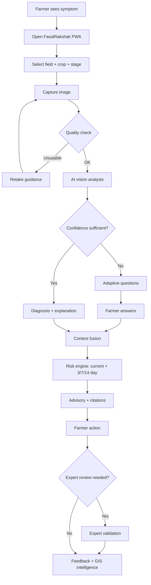

## 11. System Architecture

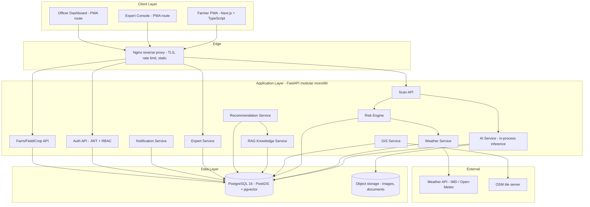

### 11.1 Component responsibilities

| Component | Responsibility | Key decision |
|---|---|---|
| **Farmer PWA** | All farmer flows; offline queue; i18n | Next.js App Router, Tailwind, Dexie IndexedDB |
| **API Gateway (Nginx)** | TLS, static assets, rate limiting, security headers | Single entry point; hides internals |
| **Auth API** | JWT access/refresh, Argon2id hashing, RBAC | Roles: farmer/extension/expert/officer/admin |
| **Farm/Field/Crop API** | CRUD farms, fields (geometry), crops, crop cycles | PostGIS geography(Point,4326) |
| **Scan API** | Scan lifecycle, image storage, dedupe, history | Idempotency key |
| **AI Service** | Quality → crop ID → disease → pest → confidence → questions | In-process, CPU-first; extractable to own container later [ARCHITECT INFERENCE] |
| **Risk Engine** | Confidence + context → current/3/7/14-day risk | Rule framework + optional XGBoost; weights labeled prototype |
| **Weather Service** | Adapter + cache + forecast + degradation | 1–6 h cache; stale-tolerant |
| **GIS Service** | Heatmaps, hotspot candidates, district aggregates | PostGIS; DBSCAN on reported/verified only |
| **RAG Service** | Grounded retrieval with citations | pgvector; template-first generation |
| **Recommendation Service** | Assemble advisory from retrieved guidance | Multilingual templates; safety notes |
| **Expert Service** | Case queue, validation, feedback | Feedback stored dataset-ready |
| **Notification Service** | Severity-based in-app alerts | Cooldowns/dedupe against spam |
| **PostgreSQL (+PostGIS, pgvector)** | System of record + vectors | One DB, three capabilities |
| **Object storage** | Images, knowledge documents | Local volume MVP; MinIO/S3 later |

### 11.2 Architecture principles
1. **Modular monolith first** — one FastAPI app with strict internal boundaries; extract AI/GIS into separate services only when load demands [ARCHITECT INFERENCE — avoids fake complexity].
2. **CPU-first inference** — nano models on CPU; GPU is an optimization, not a dependency.
3. **Postgres as the only stateful core** — relational + geospatial + vectors; backups cover everything.
4. **Every AI output is an artifact** — persisted with model version, thresholds, inputs → reproducible and auditable.
5. **Fail soft** — weather/GIS unavailability degrades features, never the core scan loop.

## 12. Detailed Data Flow

Canonical flows (full step-by-step versions in `docs/13_User_Flows.md`):

- **Flow A — Farmer Crop Scan:** client compresses image (≤1024 px JPEG) → `POST /api/v1/scans` with idempotency key → upload to object storage → quality model → threshold gate → crop-ID model (wrong-crop guard) → disease classifier top-k + calibrated confidence + OOD score → if sufficient: persist prediction + diagnosis → risk engine → advisory assembly (RAG) → response; if insufficient: question selection → questions returned.
- **Flow B — Low-Confidence Diagnosis:** max confidence below threshold or OOD score high → rank questions by expected uncertainty reduction (crop, symptom family, weather, stage) → farmer answers stored → fusion recomputes the posterior over the differential → updated diagnosis or *refer-to-expert* → risk recomputed.
- **Flow C — High-Risk Alert:** risk ≥ HIGH → create alert with dedupe key (field + threat + window) → farmer in-app alert + push (if enabled) → officer counters update → cluster emergence → hotspot candidate → officer notification.
- **Flow D — Expert Validation:** expert opens case (image + AI prediction + confidence + farmer answers + weather + crop stage + location + history) → confirm / correct / reject + remarks → `expert_reviews` row written → diagnosis status updated → farmer notified → feedback row tagged dataset-ready.
- **Flow E — GIS Hotspot Creation:** scheduled/on-write job → aggregate reported/verified cases per grid cell + DBSCAN over confirmed clusters → hotspot candidate when ≥ minimum reports within eps → officer alert. **Predicted-risk layers are rendered separately from confirmed clusters** — never presented as outbreaks.
- **Flow F — Officer Response:** officer opens hotspot → case list + trend → logs verification visit / intervention → `field_observations` updated → dashboards reflect status.
- **Flow G — Feedback → Model Improvement:** expert corrections + farmer ratings + quality-gate outcomes accumulate → periodic export to `data/` with versioned manifests → retraining candidate list → human review → new model version in registry → shadow evaluation → promotion.

## 13. Frontend Architecture

**Stack [ARCHITECT INFERENCE + brief]:** Next.js (App Router) + TypeScript + Tailwind CSS + PWA + `next-intl` + `react-leaflet` + TanStack Query + Zustand + Zod + Dexie (IndexedDB).

### 13.1 Folder structure

```
frontend/
├── src/
│   ├── app/                      # App Router: routes per role
│   │   ├── (farmer)/             # /home /scan /diagnosis/[id] /risk /history /fields
│   │   ├── (expert)/             # /expert/cases /expert/cases/[id]
│   │   ├── (officer)/            # /officer/map /officer/dashboard /officer/cases
│   │   ├── (auth)/               # /login /register /onboarding
│   │   └── api/                  # route handlers (thin proxy to backend)
│   ├── components/               # design-system primitives (Button, Card, Sheet…)
│   ├── features/                 # scan, diagnosis, risk, fields, alerts, maps, expert
│   │   └── scan/                 # components/ hooks/ api.ts
│   ├── services/                 # typed API client (fetch wrapper, retry, auth refresh)
│   ├── stores/                   # Zustand stores (session, offline queue, locale)
│   ├── hooks/                    # useGeolocation, useOnline, useAlerts
│   ├── lib/                      # image compression, quality heuristics, formatting
│   ├── types/                    # DTOs matching backend schemas (zod + TS)
│   ├── i18n/                     # en.json, hi.json, hinglish.json + agri glossary
│   └── assets/                   # icons, illustrations, empty states
├── public/                       # manifest.webmanifest, service worker, tiles config
└── tests/                        # vitest + Playwright
```

### 13.2 Key frontend decisions

| Concern | Decision | Rationale |
|---|---|---|
| State | TanStack Query (server state) + Zustand (session/queue) | Cache-friendly, offline-friendly |
| Auth | httpOnly refresh cookie + in-memory access token; silent refresh | XSS-resistant token handling |
| Errors | Error boundary per route + typed API errors + farmer-friendly mapping | UI never crashes (docs/39) |
| Forms | react-hook-form + Zod schemas shared with API types | Validation parity |
| Image upload | Client resize ≤1024 px, JPEG q≈0.8; EXIF stripped except capture time; progress + retry queue | Low bandwidth; privacy |
| i18n | next-intl locales; disease/pest names from backend glossary (per-locale labels) | Consistent agri terminology |
| Offline | Service worker precache shell + Dexie queue for scans/answers; background sync retry | docs/32 |
| Maps | react-leaflet + OSM tiles (no API key) | Zero-cost MVP; Mapbox optional later |
| Loading | Skeletons + staged progress (quality → analyzing → risk) | Trust building |
| Accessibility | ≥44 px targets, large-text mode, icon + label pairing | Low-literacy friendly |

## 14. Backend Architecture

**Stack [ARCHITECT INFERENCE]:** Python 3.11+, FastAPI, Pydantic v2, SQLAlchemy 2.0 + Alembic, PostgreSQL (PostGIS, pgvector), PyTorch (CPU) / ONNX Runtime, Ultralytics YOLO (nano), XGBoost, httpx, APScheduler (background jobs), pytest.

### 14.1 Folder structure

```
backend/
├── app/
│   ├── main.py                    # app factory, lifespan, router mount
│   ├── core/                      # config (pydantic-settings), security, logging, deps
│   ├── api/                       # routers: auth, farms, fields, crops, scans, ai,
│   │                              # risk, weather, gis, expert, officer, notifications,
│   │                              # knowledge, feedback, admin, health
│   ├── models/                    # SQLAlchemy ORM entities (docs/07)
│   ├── schemas/                   # Pydantic request/response DTOs
│   ├── services/                  # domain services (scan_service, field_service…)
│   ├── ai/                        # inference pipeline
│   │   ├── quality/               # image-quality engine
│   │   ├── crop_id/               # crop/leaf identification
│   │   ├── disease/               # disease classifier + OOD/calibration
│   │   ├── pest/                  # YOLO pest detector
│   │   ├── explain/               # Grad-CAM export
│   │   └── registry.py            # model registry, versions, thresholds
│   ├── risk/                      # risk engine: factors, rules, optional XGBoost
│   ├── questions/                 # adaptive question engine + question bank data
│   ├── fusion/                    # multimodal context fusion
│   ├── gis/                       # PostGIS queries, hotspot jobs, clustering
│   ├── weather/                   # provider adapters, cache, validation
│   ├── rag/                       # ingestion, chunking, embeddings, retrieval
│   ├── recommendations/           # advisory assembly + templates + guardrails
│   ├── notifications/             # alert creation, severity, dedupe
│   └── utils/
├── migrations/                    # Alembic
├── tests/                         # unit + integration (test DB fixtures)
└── pyproject.toml / requirements.txt
```

### 14.2 Backend conventions

- **Routers thin, services fat:** routers parse/validate → services own business rules → ORM owns persistence.
- **AI calls** go through a single `ai/pipeline.py` orchestration point, so the AI service can be extracted into its own container without touching API code [ARCHITECT INFERENCE].
- **Async** endpoints; CPU-bound inference runs in a bounded thread/process pool with per-stage timeouts.
- **Middleware:** request-ID + structured logging, auth, RBAC scope check, rate limiting, body-size limits, standard error envelope.
- **Background jobs** (APScheduler): weather refresh, GIS hotspot job, notification digests, model-registry sync. Redis/queue-based workers marked **[FUTURE FEATURE]**.
- **Idempotency:** scan submission carries `client_scan_uuid`; duplicates return the original result.

## 15. AI/ML Architecture

**Design stance:** every model exists to remove a specific failure mode. Four vision models + one optional tabular model + an OOD/calibration layer. CPU-first, versioned, monitored [ARCHITECT INFERENCE on feasibility; SOURCE-DERIVED on scope].

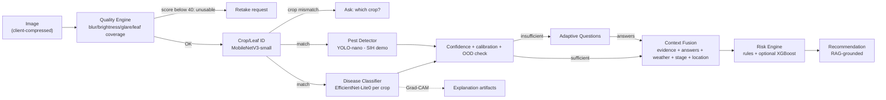

### 15.1 Model portfolio

| Model | Task | Candidate architecture | Output | Priority |
|---|---|---|---|---|
| M1 Quality | Usability gate | Heuristics (Laplacian variance, histogram, EXIF) + tiny CNN head for leaf coverage | Score 0–100 + category + reasons | P0 |
| M2 Crop ID | Wrong-crop guard | MobileNetV3-small / EfficientNet-Lite0, ~10–20 crop classes | Crop label + confidence | P0 |
| M3 Disease | Per-crop disease classification | EfficientNet-Lite0 / MobileNetV3 (transfer learning: ImageNet → PlantVillage/PlantDoc → field data) | Top-k labels + calibrated probabilities + OOD score | P0 |
| M4 Pest | Visible insect detection | YOLOv8n/YOLO11n, few classes (aphid, whitefly, caterpillar…) | Boxes + classes + confidences | P1 (SIH demo) |
| M5 Risk (optional) | Learned risk refinement | XGBoost on historical labeled cases | Risk score/probability | P2 (rules at MVP) |

### 15.2 Pipeline stages (details in docs/06)
1. **Dataset requirements:** per-crop disease classes with ≥300 usable images/class target from public datasets + field captures; explicit `unknown/healthy` classes; pest classes ≥500 instances each target.
2. **Cleaning:** dedupe (perceptual hash), corrupt scan, quality-filter with M1 (train on usable images only), EXIF normalization.
3. **Labeling:** public labels inherited; field images labeled in a labeling tool; **expert-verified only** as ground truth; ambiguous samples flagged.
4. **Splits:** per-field (not per-image) train/val/test split to prevent leakage; 70/15/15, stratified by class.
5. **Augmentation:** flips, crops, brightness/contrast jitter, mild blur — no distortions that change lesion appearance.
6. **Imbalance:** class-weighted loss / minority oversampling; per-class metrics reported (macro-F1 mandatory).
7. **Transfer learning:** ImageNet-pretrained backbone; two-stage fine-tune (head first, then full network at low LR).
8. **Evaluation:** per-class precision/recall/F1, confusion matrix, macro-F1; ROC-AUC per class where appropriate; **calibration via temperature scaling with ECE reported**; OOD via max-softmax + energy score, thresholds tuned on held-out non-target images.
9. **Unknown/OOD:** if OOD score high or confidence below threshold → `insufficient_evidence` (never a forced label).
10. **Versioning & monitoring:** every inference records model version + thresholds; drift watched via confidence distribution and expert-disagreement rate.

### 15.3 Explicit honesty rules [PROPOSED DESIGN]
- No accuracy claims without a held-out evaluation recorded in `docs/17`.
- **"Unknown / Insufficient Evidence" is a first-class system output**, preferable to a forced diagnosis [SOURCE-DERIVED].
- Public-dataset results are reported as *dataset performance*, never as *field performance* (docs/18).
- Visually similar diseases are handled as a differential (top-k + questions), not resolved by force.

## 16. Image Quality Engine

**Purpose:** reject unusable images *before* AI runs — the cheapest possible failure prevention [PROPOSED DESIGN].

**Evaluated dimensions:** blur · darkness · overexposure/glare · occlusion (leaf visibility) · resolution · background interference.

**Method (layered, explainable):**
1. **Resolution check** — minimum effective size (e.g., ≥224 px subject coverage).
2. **Blur** — Laplacian-variance sharpness on the leaf region; very low variance → blurry.
3. **Exposure** — histogram analysis: fraction of near-black / near-white pixels → darkness / glare.
4. **Leaf visibility** — lightweight segmentation (color-space heuristics + optional tiny CNN) estimating the fraction of the frame that is actual plant tissue; low coverage or heavy occlusion → poor.
5. **Composite score** — weighted sum of normalized sub-scores (weights are prototype constants, tunable), mapped to: **Good (≥80) / Acceptable (60–79) / Poor (40–59) / Unusable (<40)**.
6. **Actionable feedback** — the engine returns *reasons*, not just a score: "image is blurry — hold the phone steady", "too dark — move to open light", "leaf too far — fill the frame with the leaf".

**Outputs:** `{quality_score, category, reasons[], leaf_coverage, usable: bool}`. Unusable → farmer is asked to retake (guided capture tips) — no AI diagnosis is produced. Poor-but-usable images proceed with a visible warning and reduced confidence ceiling **[PROPOSED DESIGN: quality feeds into the fusion layer as an evidence-reliability modifier]**.

## 17. Adaptive Question Engine

**Differentiator [SOURCE-DERIVED — inspired by Chain-of-Inquiry / PlantInquiryVQA; External Research R1].** The system does not ask a fixed questionnaire; it asks only what is needed to reduce uncertainty about the current differential.

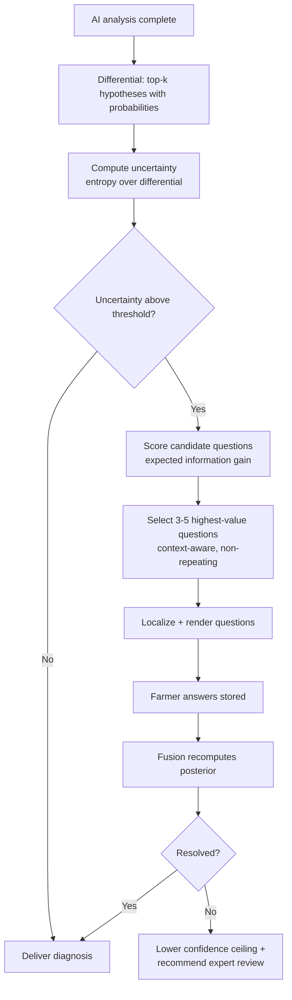

**How it works:**
1. **Question bank:** curated questions tagged with `crop`, `symptom_family`, `hypothesis_relevance`, `context_need` (weather/stage/history), answer type (choice/boolean/number), and per-answer evidence updates. Bank stored in DB (`question_bank`) — data-driven, extensible.
2. **Selection:** with top-k hypotheses P(hᵢ) from the classifier, each candidate question q is scored by expected entropy reduction: `IG(q) = H(P) − E_a[H(P | answer a)]` computed from the tagged per-answer likelihood updates. Top 3–5 by IG, filtered for relevance to the actual differential and for information the system already has (e.g., don't ask about rainfall if weather data exists).
3. **Answer integration:** answers are converted into likelihood updates over the differential (rule-based evidence updates defined per question — transparent and reviewable, not learned black boxes at MVP).
4. **Loop control:** maximum 2 rounds; if uncertainty remains high → cap confidence, mark `expert_recommended`.
5. **Examples:** "When did symptoms first appear?" · "Are the spots spreading?" · "Any rainfall in the last week?" (skipped if weather known) · "Lower or upper leaves first?" · "Are insects visible?"

**Categories [SOURCE-DERIVED]:** symptom-history · progression · distribution · environmental · pest-presence · treatment-history.

## 18. Multimodal Context Fusion

**Purpose:** combine all evidence into one coherent, explainable diagnosis + risk input [SOURCE-DERIVED].

**Inputs:** visual evidence (labels + calibrated confidence + OOD) · farmer answers · weather (observed + forecast) · crop stage · location/region · field history (previous scans/observations) · regional prevalence signals · soil/IoT when available **[FUTURE FEATURE for IoT]**.

**Architecture (hybrid, explicit per component):**
- **Rule-based layer:** deterministic evidence updates (e.g., "rain in last 72h AND high humidity → boost fungal-hypothesis prior"), quality-score reliability modifier, crop-stage applicability filters (a fruit-stage-only disease is down-weighted in the seedling stage).
- **Probabilistic layer:** normalize hypotheses into a posterior over the differential — prior (base rates, regional prevalence where known) multiplied by visual likelihood, updated by answer-derived likelihoods; **Bayesian-lite framing, not a full graphical model at MVP** [PROPOSED DESIGN].
- **Retrieval-based layer:** knowledge base provides per-disease context (favorable conditions, look-alikes) **with citations**; retrieval failure never blocks fusion — it only removes modifiers.
- **ML layer (optional, later):** XGBoost fusion/risk model once labeled outcome data exists **[ADVANCED]**.

**Output:** fused hypothesis distribution + evidence trace (which input moved which hypothesis, in which direction) + reliability flags (poor image, missing weather). The trace is what makes the system explainable — the farmer/expert/officer UIs render it.

## 19. Risk Engine

**Key principle [SOURCE-DERIVED]: risk ≠ confidence.** Three separable quantities:

| Quantity | Question | Example |
|---|---|---|
| **Diagnosis Confidence** | How sure is the AI about the *identity* of the problem? | 89% early blight |
| **Disease/Pest Risk** | How significant is the threat *now*, given context? | Current risk: Medium |
| **Escalation Risk (3/7/14 days)** | How likely is the situation to *worsen*? | 7-day escalation: High |

A confident diagnosis of a minor issue can be Low-risk; a low-confidence sighting under highly favorable weather can be High-risk. Conflating them would mislead farmers and officers.

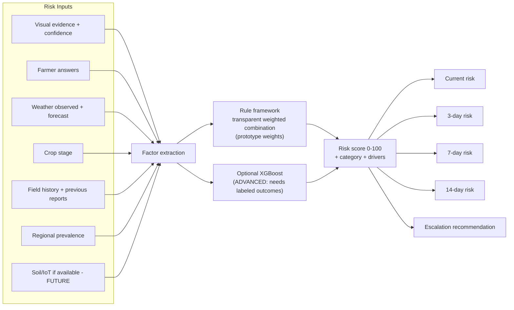

**Scoring strategy (transparent):**
`Risk = w_e·Evidence + w_w·WeatherSuitability + w_s·StageSusceptibility + w_h·HistoryPressure + w_r·RegionalPressure` (0–100), with:
- **Evidence** from fused posterior + visual confidence + image quality reliability.
- **WeatherSuitability** from configurable per-threat condition rules sourced from the knowledge base **with citations**; generic agronomic heuristics (humidity/leaf-wetness favor fungal pressure) are labeled as general heuristics — no fabricated pathogen-specific claims.
- **Weights are explicitly prototype weights** [PROPOSED DESIGN], stored in config, versioned, and never presented as scientifically validated.
- **Outlook:** 3/7/14-day risk uses forecast inputs + known incubation/spread characteristics from the knowledge base; forecast confidence degrades with horizon and is shown.
- **Outputs:** score, category (Low/Medium/High/Critical), top drivers (plain language), recommended action, escalation recommendation.
- **Calibration & review:** risk outcomes are tracked against expert verdicts; rules and weights are reviewed and adjusted — an explicit learning loop, not a hidden model.

## 20. Weather Intelligence

**Data:** temperature · humidity · rainfall · wind · short-range forecast · weather alerts [SOURCE-DERIVED inputs].

| Concern | Design |
|---|---|
| **Adapter pattern** | `WeatherProvider` interface; MVP providers: Open-Meteo (free, no key) primary, IMD-sourced feeds where accessible; providers swappable via config |
| **Caching** | Per-field cache: observations 1 h, forecast 3–6 h; served from DB; stale data flagged with age |
| **Fallback chain** | fresh cache → stale cache (flagged) → regional default climatology (flagged) → "weather unknown" state; **the risk engine never silently imputes weather** |
| **Validation** | Range/clamp checks (e.g., 0–100% RH, plausible temps); unit normalization; missing variables flagged individually |
| **Rate limits** | Respect provider quotas; backoff on 429/5xx; circuit breaker disables provider after repeated failures |
| **Missing data** | `weather_completeness` per field returned to UI; risk output marks weather-dependent factors as unavailable |

**How weather affects risk (honest framing):** weather enters as *suitability modifiers* using general agronomic principles (e.g., extended leaf wetness and high humidity generally favor fungal/bacterial disease pressure; warm dry spells favor some pests) and per-threat rules where authoritative sources provide them (docs/11). We make **no fabricated pathogen-specific thresholds**; where thresholds exist in the knowledge base they are cited; otherwise generic heuristics with lower weight are used [PROPOSED DESIGN].

## 21. GIS Intelligence

**Stack:** PostGIS (geometry/geography columns, spatial indexes) + Leaflet/OSM frontend rendering [ARCHITECT INFERENCE; brief specifies Leaflet/Mapbox + PostGIS].

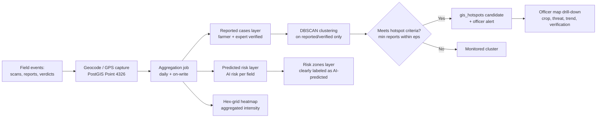

**Features:** field locations · disease reports · pest reports · risk heatmap (hex-grid aggregation) · disease/pest hotspots · regional trends · cluster detection · officer map · historical comparison.

**DBSCAN usage (only where appropriate):** DBSCAN clusters *confirmed/reported* geolocated cases into hotspot candidates — it needs no pre-set cluster count and naturally leaves noise points out. It is **not** applied to AI-predicted risk values; predicted risk is rendered as a separate, clearly labeled layer. **Core distinction enforced product-wide: "reported cases" ≠ "AI-predicted risk" ≠ "expert-verified case"** [SOURCE-DERIVED discipline].

## 22. RAG Architecture

**Purpose:** every recommendation must be traceable to an authoritative source; the system must not hallucinate agricultural advice [SOURCE-DERIVED safety requirement].

```
Knowledge sources (ICAR / state agricultural universities / government
extension / IPM resources / official advisories - publicly available only)
  -> Ingestion (PDF/HTML extraction + source metadata: title, publisher, year, URL)
  -> Cleaning & chunking (semantic chunks ~300-600 tokens, crop/pest/stage tags)
  -> Embeddings (small multilingual sentence-embedding model)
  -> Vector store: pgvector inside the main Postgres (one system to back up)
  -> Retrieval (top-k filtered by crop + threat + stage, then similarity)
  -> Grounded assembly (template-first; any LLM is restricted to retrieved chunks)
  -> Citations rendered with every recommendation
```

**Design decisions:**
- **pgvector, not a separate vector DB** [ARCHITECT INFERENCE — one less service; corpus is small (hundreds–thousands of chunks)].
- **Template-first generation:** MVP assembles advisories from retrieved chunks via localized templates (deterministic, auditable). An LLM may *rephrase only what retrieval returned*, with refusal when retrieval is empty **[SIH DEMO enhancement]** — never free generation.
- **Every recommendation carries:** source title + publisher + year, applicable crop/region/stage, safety note, applicability tag.
- **No auto-prescription:** pesticide/chemical content surfaces only what verified sources state, with safety notes and a "consult your local agriculture officer/KVK" line [SOURCE-DERIVED].
- **Cross-lingual retrieval:** sources may be English; multilingual embeddings enable Hindi/Hinglish queries; rendering is localized (glossary-consistent).

## 23. Recommendation Engine

**Output shape (farmer-friendly) [SOURCE-DERIVED example format]:**

> **Problem:** Possible early blight · **Confidence:** 91% · **Risk:** High
> **Why:** Visual symptoms + recent humid/rainy conditions
> **Next steps:** 1) Inspect nearby plants 2) Remove severely affected plant material where appropriate 3) Improve field monitoring 4) Follow locally approved IPM guidance 5) Contact an agricultural expert if symptoms worsen

**Assembly pipeline:** fused diagnosis → retrieve per-threat guidance (IPM first) → filter by crop/stage/region/severity → order steps (immediate containment → monitoring → treatment decision → escalation) → localize (en/hi/Hinglish) → attach sources + safety note → render numbered steps (max 5) with icons.

**Properties:** actionable · explainable · safe (IPM-first, no unverified chemicals) · localized · multilingual · escalation-aware (always states when to involve an expert/officer) [SOURCE-DERIVED].

## 24. Expert Validation Layer

Human-in-the-loop is core [SOURCE-DERIVED]. The AI is allowed — and expected — to say **"Expert review recommended."**

**Expert receives per case:** original image (+ quality data) · AI prediction + top-k differential + confidence · farmer answers · weather/context · crop stage · location (district-level by default) · previous field observations.

**Expert actions:** **Confirm** AI prediction · **Correct** (select actual disease/pest) · **Reject** (not a disease/pest / unusable) · **Add remarks** — all with optional severity/extent tags.

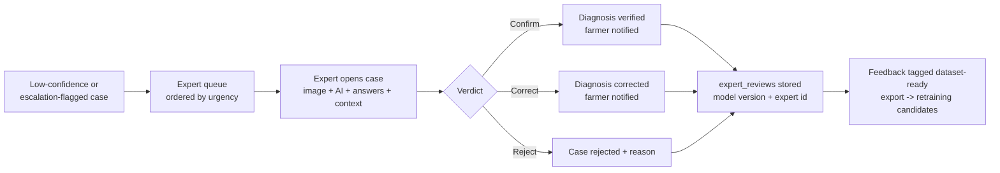

**Feedback → future intelligence (Flow G):** every verdict stores the original AI prediction, corrected label, model version, confidence, answers and context snapshot — a **labeled training example in production form**. Periodic export produces versioned dataset manifests; correction-rate dashboards expose weak classes; retraining is human-approved (docs/18).

**Feedback Loop (diagram 11 of 12):**

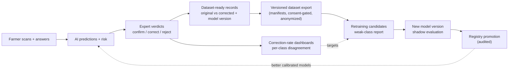


## 25. Officer Dashboard

**Cards:** monitored fields · active alerts · high-risk fields · disease reports · pest reports · pending expert cases · emerging hotspots.

**Main visualization:** GIS risk map (Leaflet) with three layers — **AI-predicted risk** (heatmap, labeled "AI prediction") · **reported cases** (field markers) · **expert-verified cases** (distinct markers). Clicking a hotspot shows: location · crop · threat · number of reports · risk level · trend (rising/stable/declining) · last update · recommended intervention · **verification status**.

**Workflows:** case drill-down → inspection logging → intervention tracking (what was advised/done, when) → escalation to state level **[FUTURE FEATURE]** · CSV/PDF reports **[P2]**.

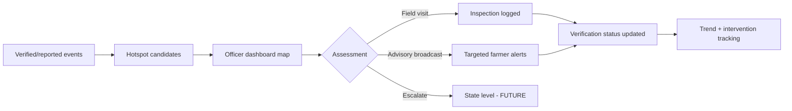

## 26. Notification System

| Aspect | Design |
|---|---|
| **Recipients** | farmer alerts (own fields), officer alerts (district), expert review alerts (queue) |
| **Severities** | LOW · MEDIUM · HIGH · CRITICAL [SOURCE-DERIVED] |
| **Channels** | in-app (MVP) · web push (P2) · SMS adapter stub [FUTURE FEATURE] |
| **Triggers** | risk crossing HIGH/CRITICAL · expert verdict ready · new district hotspot · adverse weather window (P2) |
| **Anti-spam** | dedupe key (field + threat + window), per-field cooldown, severity throttling, digest option, user preferences [PROPOSED DESIGN] |
| **Delivery** | `notifications` + `alerts` tables; in-app via polling at MVP (WebSockets **[FUTURE FEATURE]**) |

## 27. Database Architecture

**PostgreSQL 16 + PostGIS + pgvector**; normalized (3NF for transactional entities); UUIDv7-style primary keys (time-ordered) [PROPOSED DESIGN]; all timestamps UTC `timestamptz`; soft-delete only where required (farms/users) via `is_active` flags; full SQL DDL lives in `docs/07_Database_Design.md`.

### 27.1 Core entity groups

**Identity & access**
- `users` — id PK, phone/email (unique), password_hash (Argon2id), full_name, preferred_language, district, state, role_id FK, is_active, created_at, last_login_at.
- `roles` — id, name (farmer/extension_worker/expert/district_officer/admin), description. `user_roles` M:N where a user holds multiple roles [PROPOSED DESIGN].
- `refresh_tokens` — user FK, token_hash, expires_at, revoked_at.

**Farm & field structure**
- `farms` — id, owner FK→users, name, address, district, state, is_active.
- `fields` — id, farm FK, name, area_hectares, **location geography(Point,4326)** (PostGIS, GIST index), soil_type, district_code.
- `crops` — catalogue: id, name_en/hi, scientific_name, variety_notes, is_supported (MVP: tomato, potato, cotton).
- `crop_cycles` — id, field FK, crop FK, sowing_date, expected_harvest_date, current_stage (derived), status.

**Scanning & AI artifacts**
- `crop_scans` — id, client_scan_uuid (unique, idempotency), field FK, crop_cycle FK, user FK, plant_part, captured_at, image FK, status enum (pending/analyzing/answered/completed/failed), created_at.
- `images` — id, storage_path, original_filename, mime_type, size_bytes, width, height, checksum_sha256 (unique — dedupe).
- `image_quality_results` — scan/image FK, quality_score, category, reasons jsonb, leaf_coverage, usable.
- `ai_predictions` — id, scan FK, model FK→model_registry, prediction_type (disease/pest/crop_id), label_code, label_confidence, topk jsonb, ood_score, is_sufficient, explainability_ref, latency_ms, created_at.
- `pest_detections` — ai_prediction FK, pest_code, confidence, bbox jsonb, count_estimate.
- `model_registry` — id, name, version, artifact_uri, metrics jsonb, thresholds jsonb, status (shadow/active/retired), activated_at.

### 27.2 Inquiry, risk & advisory entities
- `questions` / `question_bank` — question bank: id, code, text_en/hi, answer_type, tags jsonb (crop, symptom_family, context_need), evidence_updates jsonb, is_active. `question_answers` — id, scan FK, question FK, answer_value, answered_at.
- `diagnoses` — id, scan FK, final_status (diagnosed/insufficient_evidence/referred/expert_confirmed/expert_corrected/rejected), primary_label_code, fused_confidence, differential jsonb, evidence_trace jsonb, final_label_code (post-validation), created_at.
- `risk_predictions` — id, field FK, scan FK nullable (field-level risk), risk_type (current/3d/7d/14d), score, category, factors jsonb, weather_completeness, model_ref (rules version or XGBoost version), created_at.
- `recommendations` — id, diagnosis FK, locale, steps jsonb (ordered), sources jsonb (citations), safety_note, generated_by (template/llm-grounded), version.
- `knowledge_documents` — id, title, publisher, source_url, publication_year, language, doc_type, checksum, ingestion_status. `knowledge_chunks` — id, document FK, chunk_index, content, embedding vector(pgvector), tags jsonb; IVFFlat/HNSW index.
- `weather_observations` — id, field FK, observed_at, temperature_c, humidity_pct, rainfall_mm, wind_kmph, forecast_json jsonb, provider, data_age_hours, completeness jsonb.

### 27.3 Surveillance & workflow entities
- `field_observations` — id, field FK, observer FK (user), observation_type (farmer_report/expert_visit/officer_inspection), disease_code nullable, pest_code nullable, severity, notes, observed_at.
- `disease_reports` / `pest_reports` — id, field FK, reported_by FK, source (farmer/ai/expert/officer), disease_code/pest_code, status (reported/ai_predicted/expert_verified/rejected), report_date, verified_by FK nullable.
- `gis_hotspots` — id, district, centroid geography(Point,4326), cluster_size, threat_type, threat_code, status (candidate/confirmed/dismissed), trend, first_seen_at, last_updated_at, parameters jsonb (eps, min_reports).
- `expert_reviews` — id, diagnosis FK, expert FK, verdict (confirmed/corrected/rejected), original_prediction, corrected_label_code, remarks, reviewed_at, model_version.
- `notifications` — id, user FK, type, payload jsonb, read_at, created_at. `alerts` — id, dedupe_key (unique), severity (LOW/MEDIUM/HIGH/CRITICAL), audience (farmer/officer/expert), field FK nullable, district nullable, threat_code, message_key, status, created_at, expires_at.
- `feedback` — id, user FK, scan FK nullable, diagnosis FK nullable, rating (useful/not_useful), expert_feedback bool, dataset_tag, comment, created_at.
- `audit_logs` — id, user FK nullable, action, resource_type, resource_id, ip_hash, before/after jsonb, created_at. Append-only.

### 27.4 Indexes & constraints (representative)
- GIST on all geography columns; HNSW on embeddings; btree on (field_id, created_at), scan status, alert dedupe_key unique, images checksum unique, users phone/email unique.
- FKs with appropriate ON DELETE (RESTRICT for artifacts; CASCADE for scan→quality/answers children); CHECK constraints on enums/score ranges (0–100); NOT NULL on audit-critical columns.

## 28. ER Diagram Description

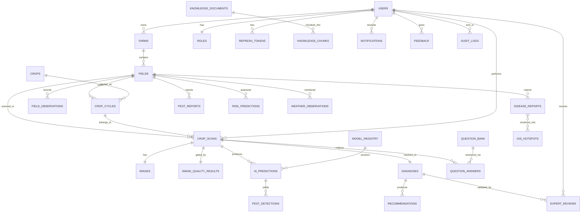

**Relationship types:** *one-to-one* — scan↔image, scan↔quality result, scan↔diagnosis (each scan resolves to exactly one diagnosis record; content may evolve). *One-to-many* — farm→fields, field→scans, scan→predictions, diagnosis→recommendations, document→chunks. *Many-to-many* — users↔roles (via `user_roles`), reports↔hotspots (via cluster membership table `hotspot_members` in the full DDL), crops↔regions applicability (via `crop_region_applicability` **[P2]**).

**PostGIS usage:** `fields.location geography(Point,4326)` with GIST index for proximity (nearby fields, distance sorting); `gis_hotspots.centroid` for district aggregation; grid aggregation via `ST_SnapToGrid`/hex binning for heatmaps; DBSCAN implemented via a PL/pgSQL/window-function based spatial clustering job (or PostGIS-add-on pattern) over reported/verified points only; district boundaries via a `regions` geometry table **[P2]**.

## 29. API Architecture

REST under `/api/v1/`, JWT bearer auth (except auth endpoints), JSON bodies, standard error envelope `{code, message, details}`, cursor pagination, idempotency keys on mutations that create artifacts. Full endpoint-by-endpoint spec: `docs/08_API_Documentation.md`.

| Method & Endpoint | Purpose | Auth role |
|---|---|---|
| POST `/api/v1/auth/register` · `/login` · `/refresh` · `/logout` | Account lifecycle | public/farmer |
| GET/PATCH `/api/v1/users/me` | Profile | any |
| CRUD `/api/v1/farms` · `/api/v1/fields` · `/api/v1/crops` · `/api/v1/crop-cycles` | Farm structure | farmer own; officer district-read |
| POST `/api/v1/scans` · GET `/api/v1/scans/{id}` · GET `/api/v1/scans?field_id=` | Scan lifecycle | farmer own |
| POST `/api/v1/scans/{id}/image` | Image upload | farmer own |
| POST `/api/v1/scans/{id}/questions` · `/answers` | Adaptive Q&A | farmer own |
| POST `/api/v1/ai/analyze` | Trigger analysis pipeline (idempotent) | system/farmer |
| GET `/api/v1/diagnoses/{scan_id}` | Fused diagnosis + evidence trace | owner roles |
| GET `/api/v1/risk/{field_id}` · `?horizon=3\|7\|14` | Risk + outlook | owner roles |
| GET `/api/v1/weather/{field_id}` | Weather context | owner roles |
| GET `/api/v1/gis/heatmap?district=` · `/api/v1/gis/hotspots` | Surveillance layers | officer/extension (farmer: none) |
| GET `/api/v1/officer/dashboard` | District overview | officer |
| GET `/api/v1/expert/cases` · POST `/api/v1/expert/review` | Validation workflow | expert |
| GET `/api/v1/notifications` · PATCH `/api/v1/notifications/{id}/read` | Alerts | any (own) |
| POST `/api/v1/feedback` | Farmer/expert feedback | any (own) |
| GET `/api/v1/knowledge/search?q=` | RAG retrieval preview | expert/admin |
| Admin: `/api/v1/admin/users` · `/knowledge/ingest` · `/models` · `/config` | Administration | admin |
| GET `/api/v1/health` · `/ready` | Liveness/readiness | public |

**Example — `POST /api/v1/scans`** (auth: farmer; body: `{field_id, crop_cycle_id, plant_part, client_scan_uuid, captured_at}`; 201 → `{scan_id, status:"pending_image"}`; errors: 400 validation, 401, 403 not-owner, 409 duplicate (returns existing scan), 413 payload too large). **`POST /api/v1/ai/analyze`** (system; body `{scan_id}`; 200 → `{quality, predictions[], diagnosis, risk, recommendation|questions[]}`; 422 quality-unusable with retake reasons; 503 model unavailable → scan stays `pending`, retried).

**Status codes used:** 200/201 success · 400 validation · 401 unauthenticated · 403 forbidden · 404 missing · 409 conflict/duplicate · 413 too large · 422 unprocessable (quality gate, insufficient evidence is a *success* state, not an error) · 429 rate-limited · 500 unexpected · 503 dependency unavailable.

## 30. Security Architecture

| Control | Implementation [PROPOSED DESIGN / ARCHITECT INFERENCE] |
|---|---|
| Authentication | JWT access (15 min) + refresh (rotating, httpOnly cookie), revocation list; Argon2id password hashing |
| Authorization | RBAC middleware + **row-level scoping** (owner/district/expert-assignment) enforced in services, not UI |
| Transport | HTTPS only (Nginx TLS), HSTS, TLS 1.2+; HTTP→HTTPS redirect |
| Input validation | Pydantic v2 schemas on every endpoint; strict types; length/range limits |
| File security | Magic-byte + MIME validation (JPEG/PNG/WebP only), size cap (10 MB), image re-encode (strips EXIF/payloads), checksum dedupe, random storage keys, served via backend (no direct object URLs) |
| Injection prevention | SQLAlchemy ORM/parameterized queries only; no string SQL; PostGIS params bound |
| Rate limiting | Nginx `limit_req` + app-level per-user limits; stricter on auth & AI endpoints |
| CORS | Explicit origin allowlist; no wildcard with credentials |
| Secrets | `.env`/secret store outside code; never logged; per-environment separation |
| Audit logging | Append-only `audit_logs` for auth events, admin actions, expert verdicts, data exports |
| Secure errors | Generic messages to clients; details only server-side logs; no stack traces in responses |
| Dependencies | Pinned versions; `pip-audit`/`npm audit` in CI |
| Headers | X-Content-Type-Options, X-Frame-Options DENY, Referrer-Policy, CSP (script-src 'self') |

**Data-access rules:** farmers see only their own farms/fields/scans/results; experts only assigned/queued cases; officers get **district aggregates by default** — individual-identity access is a separate audited permission; admins are audit-logged on every action. No cross-farmer listing endpoints exist.

## 31. Privacy Architecture

- **Data minimization:** collect only what the product needs — phone number (or email), name, preferred language, district, farm/field locations, images, answers. **Not collected:** Aadhaar/government IDs, precise home address, contacts, background location tracking.
- **Location granularity:** farmer GPS captured only during field registration/scan (explicit action, not continuous). Officer views show district-level aggregation; exact field coordinates are role-gated and audited.
- **Image privacy:** EXIF stripped client-side (except capture time); images used for model improvement **only with consent flag** (per-user setting, default ask-on-first-scan).
- **Consent & data rights:** plain-language consent at registration (localized); account deletion removes personal data and anonymizes artifacts (scans retained as anonymized research rows or deleted on request) [PROPOSED DESIGN].
- **Anonymization for ML:** dataset exports carry field/crop/label + region bucket, never names/phones; farmer identity never enters training data.
- **Children/data residency:** no minor-targeted features; deployment targets Indian cloud/on-prem; data residency documented in deployment guide.
- **Third parties:** weather provider receives only lat/long rounded to ~2 decimal places (~1 km) — never user identity.

## 32. Low Connectivity Architecture

Rural-first design [SOURCE-DERIVED target users]:

| Capability | Design |
|---|---|
| **PWA** | Installable app shell; service worker precaches shell + assets; works after first load without network |
| **Client compression** | Images resized ≤1024 px, JPEG q≈0.8 → typically 100–300 KB per scan |
| **Offline capture** | Scan wizard fully usable offline; scan + answers stored in IndexedDB (Dexie) outbox |
| **Retry queue** | Outbox syncs on reconnect (background sync + manual retry); exponential backoff; order preserved; idempotency keys make retries safe |
| **Caching** | Last advisories, field data, glossary cached; weather cached with age labels |
| **Progressive upload** | Image uploads with resumable progress; failure resumes rather than restarts |
| **Lightweight UI** | No heavy frameworks per page; map tiles lazy-loaded; low-data mode reduces tile detail |
| **What works offline** | capture scans, write answers, view cached history/advisories, queue everything |
| **What requires network** | AI analysis, fresh weather, expert/officer sync, map tiles first load |

**Honest limitation:** AI inference requires the backend (server-side). A fully offline on-device model is an **edge-AI [FUTURE FEATURE]**; at MVP, offline scans are queued and analyzed on reconnect.

## 33. Deployment Architecture

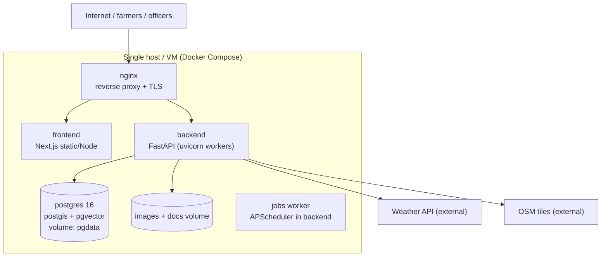

**Services (docker-compose):** `frontend` (Next.js build served by its own container or nginx), `backend` (uvicorn), `db` (postgis/postgres image with pgvector), `nginx`, volumes (`pgdata`, `media`). AI inference runs inside `backend` at MVP; a separate `ai-service` container is the documented extraction path **[ADVANCED]**.

**Environments:**
- **Development:** compose with hot-reload, seeded demo data, debug logging.
- **Staging:** same images as production, demo/staging secrets, test weather keys.
- **Production:** pinned image versions, TLS via Let's Encrypt, secrets from environment/secret store, restart policies, log rotation.

**Operations:** env vars documented in `.env.example`; backups nightly `pg_dump` + media volume sync (retention 7–30 days); migrations via Alembic run on deploy (backward-compatible steps); model artifacts versioned under `models/` registry with SHA checksums; object storage = volume at MVP → MinIO/S3 **[ADVANCED]**; CI (GitHub Actions): lint + typecheck + tests + docker build on PR; deploy script documented for a single VM.

## 34. Monitoring & Observability

- **Structured JSON logging** (request ID, user role, route, latency, outcome) — mandatory at MVP.
- **AI inference logs:** per-call model version, latency, confidence, OOD, outcome → `ai_predictions` doubles as the monitoring ledger.
- **Error tracking:** Sentry-compatible hook **[P2 optional]**; otherwise log-based triage.
- **Metrics:** Prometheus endpoint + Grafana dashboards **[optional at MVP; P2]** — API latency, error rate, scan throughput, queue depth, weather-cache hit rate.
- **Model monitoring:** confidence-distribution drift, expert disagreement rate per class, quality-gate rejection rate, OOD firing rate.
- **Health checks:** `/health` (liveness), `/ready` (DB + model artifacts present).

## 35. Dataset Strategy

| Data source | Type | Use | Notes |
|---|---|---|---|
| PlantVillage (public) | Lab-condition leaf images | Disease classifier pre-training | Lab images ≠ field images; treat as pre-training only |
| PlantDoc (public) | Field-condition images | Fine-tune + val realism | Small; leakage-prone — split per plant/session |
| IP102 / similar public pest sets | Pest images | YOLO training | Class mapping to Indian pest priority list needed |
| Team field captures | Real farm images | The most valuable data | Ethics/consent; quality-gated; expert-labeled |
| Expert-verified app cases | Production labels | Continuous improvement | From `expert_reviews` export |
| Weather archives | Public/free APIs | Risk-model features | IMD-sourced where accessible |
| ICAR/state/university documents | Text | RAG knowledge base | Publicly available material with source metadata |

**Process:** collect → clean (dedupe by pHash, quality gate) → label (expert-verified; ambiguity flagged) → version (dataset manifest: source, version, split hash — DVC-style) → split per-field/session (leakage prevention) → augment → train → evaluate → register.

**Critical discipline [SOURCE-DERIVED]:** *dataset performance ≠ real-world field performance.* We report both separately: benchmark results on curated test sets, and (when available) small-scale field validation with confidence intervals. We will never quote benchmark numbers as field accuracy.

## 36. Model Training Strategy

- **Two-stage transfer learning:** ImageNet-pretrained backbone → head training (frozen backbone) → full fine-tune at low LR; early stopping on val macro-F1.
- **Per-crop heads:** one disease classifier per supported crop (cleaner classes, smaller models, easier updates) behind a crop-ID gate.
- **Class imbalance:** weighted loss + minority oversampling; monitor per-class recall floor (a disease class with near-zero recall is worse than no class).
- **Calibration:** temperature scaling on validation; report ECE; thresholds chosen for target precision/recall trade-off (documented per class).
- **OOD:** energy/max-softmax scoring; threshold from held-out out-of-scope images (other crops, non-leaf objects).
- **Reproducibility:** fixed seeds, config-as-code, dataset manifest hash + model version + metrics stored in `model_registry`.
- **Human gate:** no model reaches `active` without expert review of a confusion-matrix error sample.

## 37. Model Evaluation

| Model | Metrics |
|---|---|
| M1 Quality | Agreement with human quality labels (Cohen's kappa), rejection precision/recall |
| M2 Crop ID | Top-1 accuracy, wrong-crop-pass-through rate (must be ~0) |
| M3 Disease | Per-class precision/recall/F1, macro-F1, confusion matrix, ROC-AUC (per class), ECE (calibration), OOD detection recall/FP rate |
| M4 Pest | mAP@50, precision/recall per class, false-positive rate per image |
| M5 Risk (when built) | MAE/RMSE on score, precision/recall for risk events (HIGH+), calibration curve |

**System-level:** API p95 latency, inference latency, image-processing time, failure rate, uptime. **User-level:** task-completion rate, advisory comprehension (small user tests), expert agreement rate.

**Reporting rule:** every published metric states dataset, split protocol, and date; no cherry-picked single numbers; macro-F1 preferred over accuracy given imbalance.

## 38. Testing Strategy

| Layer | Scope | Tooling | MVP? |
|---|---|---|---|
| Unit | risk rules, question selection, fusion updates, scoring math, validators | pytest | yes |
| Contract/API | every endpoint: auth matrix (RBAC), validation errors, status codes, idempotency | pytest + httpx | yes |
| Integration | scan→quality→predict→risk→advisory with seeded DB; weather adapter vs recorded fixtures | pytest + test DB | yes |
| AI eval | frozen eval set, metrics vs thresholds; quality-gate cases; OOD suite | pytest + eval scripts | yes |
| Frontend unit | compression, outbox queue, i18n keys, form validation | vitest | yes |
| E2E | farmer scan flow incl. insufficient-evidence Q&A; expert verdict; officer map | Playwright | P1 |
| Load | 50 concurrent scans, p95 latency budget | k6 script | P2 |
| Security | auth bypass, IDOR on scan/field ids, upload fuzzing, rate-limit checks | scripted pytest | P1 |
| UAT | 3–5 farmers/expert walkthrough with comprehension checklist | manual | SIH demo |

## 39. Error Handling

| Failure | Detection | System behavior | Farmer message (localized) |
|---|---|---|---|
| Blurry/dark image | Quality engine | No AI run; reasons returned | "Image unclear — hold steady, fill the frame with the leaf" |
| Unsupported file | Magic-byte check | Reject upload | "Please upload a JPG/PNG photo" |
| Not a crop leaf | Crop-ID gate | No disease inference | "Doesn't look like a supported crop leaf — retake or choose crop" |
| Unknown/OOD disease | OOD score | `insufficient_evidence` + questions + expert flag | "Not enough evidence yet — please answer a few questions" |
| AI model failure | Exception/timeout | Scan stays pending; retry; ops alert | "Analysis temporarily unavailable — we'll retry automatically" |
| Weather unavailable | Provider failure/cache miss | Risk computed without weather; flagged | "Weather data unavailable — risk shown without weather" |
| DB failure | Connection error | 503; read-only fallback where safe | "Service temporarily unavailable — your data is safe" |
| Network loss (client) | Offline detection | Queue in IndexedDB; sync later | "Saved on your phone — will send when internet returns" |
| Location unavailable | Geolocation error | Manual pin on map | "Set your field location on the map" |
| Duplicate scan | Idempotency key | Return original result | (transparent — no error) |
| Invalid crop/cycle | FK validation | 400 + field-level message | "Please select a valid crop" |
| Missing crop stage | Required-field check | Prompt stage selection | "Which stage is the crop in?" |

Principles: fail soft · preserve user input · explain *what to do next* · log details server-side · never expose stack traces · every error code has an i18n key. **The UI never crashes.**

## 40. Scalability

**Pilot village → Block → District → State → Multi-state → National surveillance [SOURCE-DERIVED vision].**

| Dimension | Strategy |
|---|---|
| Database | Single Postgres at MVP; read replicas at state scale; partition scans/predictions by month; retention tiers |
| AI inference | Per-crop small models; ONNX CPU batch inference; extract `ai-service` container + queue when concurrency grows; optional GPU node |
| GIS | Precomputed materialized aggregates (hex grids, district rollups) served from aggregates, not raw points |
| API | Stateless backend → horizontal scale behind Nginx; Postgres queue → Redis/RQ workers **[ADVANCED]** |
| Regional models | Per-region/per-crop variants selected via model registry + region config |
| Language expansion | Data-driven i18n + glossary; new locale = new files, no code change |
| Crop expansion | Crop catalogue + per-crop model slots; onboarding a crop = dataset + model + config, not re-architecture |
| National scale | Multi-region deployment, aggregation services, government surveillance integration **[FUTURE FEATURE — e.g., NPSS-style feeds]** |

Capacity honesty: the MVP targets a district pilot (≈10k scans/month) on one node; each scale step is an engineering milestone, not a config change.

## 41. Sustainability

| Model | Notes |
|---|---|
| Public/government deployment | State agriculture departments/KVKs deploy as advisory infrastructure (primary path) |
| Grants & challenges | SIH → incubation grants, agri-tech programs |
| Freemium SaaS (later) | Free farmer core; paid analytics/API for FPOs & agri-ecosystem **[FUTURE FEATURE]** |
| Cost posture | Open-source stack, CPU inference, free weather/tile tiers → near-zero pilot running cost |

Sustainability principle: farmer-facing features stay free; monetization (if any) targets institutional consumers of aggregated intelligence, never pay-walling diagnosis **[PROPOSED DESIGN]**.

## 42. MVP Definition

Smallest complete working system [SOURCE-DERIVED list]:

1. Farmer login (JWT) · 2. Farm/field creation (GPS) · 3. Crop selection (tomato/potato/cotton) + cycle/stage · 4. Image upload (compressed) · 5. Image quality check with retake loop · 6. AI disease classification (per-crop) · 7. Confidence score + `insufficient_evidence` state · 8. Adaptive questions (one round) · 9. Risk score (current + 3/7/14) with factors · 10. Recommendation (template-grounded, cited, en/hi/Hinglish) · 11. Scan history · 12. Basic weather integration (current + 3-day, cached, graceful degradation) · 13. Basic officer dashboard (cards + map) · 14. Basic GIS map (fields + reported cases + heatmap).

**Explicitly not in MVP:** pest YOLO detection, XGBoost risk, expert console, hotspot clustering, push/SMS, Grad-CAM overlay, admin console, offline queue (SIH/ADVANCED/FUTURE per docs 03/19). The MVP must still ship honest uncertainty — that is non-negotiable [SOURCE-DERIVED].

## 43. SIH Prototype

Demo build = MVP + [SIH DEMO] features: pest detection (YOLO) · expert validation console · hotspot clustering + officer drill-down · offline-queue demo · feedback loop with dataset export · Grad-CAM explainability · web push notifications. Scripted so the complete story (docs/20) runs live on stage Wi-Fi **or** fully offline from a local hotspot with the stack on one laptop.

## 44. Advanced Features

| Feature | Value | Prerequisite | Priority |
|---|---|---|---|
| XGBoost learned risk | Data-tuned risk weights | Labeled outcome history | ADVANCED |
| Pest-trap image pipeline | Automated pest counts | Hardware partnership | FUTURE |
| IoT/soil sensor ingestion | Live soil context | Devices | FUTURE |
| Satellite/drone imagery | Field-level anomaly screening | Data access | FUTURE |
| Regional forecasting | Pre-season risk maps | Historical corpus | FUTURE |
| Edge AI (on-device) | Offline inference | Quantized models | FUTURE |
| SMS/IVR advisory | Feature-phone reach | Telecom integration | FUTURE |
| Government integrations | Surveillance data exchange (NPSS-style) | Official partnership | FUTURE |

## 45. Future Roadmap

- **Phase 1 — MVP** (weeks 1–6): core scan→advisory loop.
- **Phase 2 — SIH prototype** (by national demo): SIH-demo features above.
- **Phase 3 — Field validation**: small-farm pilots, comprehension testing, dataset growth, calibration review.
- **Phase 4 — District pilot**: officer workflows live, expert network, regional tuning.
- **Phase 5 — State deployment**: scale-out, integrations, more crops/languages.
- **Future:** IoT · pest traps · satellite/drone · advanced regional forecasting · edge AI · government integrations.

## 46. Project Folder Structure

```
fasalrakshak/
├── frontend/                  # Next.js PWA (farmer, expert, officer, admin UIs)
├── backend/                   # FastAPI application (API, AI, risk, GIS, RAG, weather)
├── ai/                        # Training/eval pipelines, notebooks, experiment configs
│   ├── training/  evaluation/  notebooks/
├── models/                    # Model registry manifests + artifacts (checksums/lfs)
├── data/                      # Dataset manifests, labeling guides (raw data NOT in git)
├── docs/                      # 22 numbered documents + master blueprint + _source/
├── scripts/                   # bootstrap, seed, ingest_knowledge, export_dataset
├── tests/                     # Cross-cutting E2E tests
├── docker/                    # Dockerfiles, nginx.conf, entrypoints
├── .github/workflows/         # CI: lint, typecheck, test, build
├── docker-compose.yml         # dev/staging/prod profiles
├── .env.example               # all required env vars, no secrets
├── README.md · LICENSE
```

**Why this shape:** one monorepo = one clone runs everything (SIH-friendly); `ai/` separated from `backend/` (training is offline/heavy, serving is light); `models/` versioned but not bloated into git; `data/` holds manifests, not images; `docs/` numbered for judge navigation.

## 47. Documentation Structure

The 22 documents (docs/01–22) per the README index, plus this master blueprint (docs/00): overview · problem · requirements · system/technical architecture · AI/ML · database · API · GIS · risk engine · RAG · security · user flows · UI/UX · deployment · testing · model evaluation · data strategy · roadmap · SIH demo · judge FAQ · research references. Authoring rules: every doc carries the source-discipline legend; no fabricated claims; IMPLEMENTED/MVP/SIH-DEMO/ADVANCED/FUTURE labels enforced.

## 48. Development Phases

| Phase | Weeks | Exit criteria |
|---|---|---|
| P0 Foundations | 1 | Repo, compose, DB schema, auth, CI green |
| P1 Core loop | 2–3 | Scan → quality → diagnosis → risk → advisory (en) end-to-end |
| P2 Farmer MVP complete | 4 | Questions, history, weather, i18n, error states |
| P3 SIH demo features | 5 | Expert console, officer map, hotspots, offline queue, pest demo |
| P4 Hardening + demo | 6 | E2E suite, seed script, demo story rehearsed, docs frozen |

## 49. Team Responsibilities

| Role | Owns |
|---|---|
| Frontend Dev | PWA, all role UIs, offline queue, i18n UI |
| Backend Dev | API, DB, auth/RBAC, risk engine, weather, notifications |
| AI/ML Engineer | datasets, quality/crop/disease/pest models, calibration/OOD, eval |
| GIS/Data Engineer | PostGIS, hotspots, dashboard data, dataset manifests |
| UI/UX | flows, wireframes, low-literacy patterns, demo visuals |
| Docs/Pitch | docs/01–22, judge FAQ, demo script, slides |

**Compression for smaller teams:** 3 people → A: frontend+UX · B: backend+risk/weather · C: AI/ML+GIS+docs. 4 people → docs/pitch to B. 5–6 → full mapping. Rule: every module has exactly one owner; second-member review.

## 50. Risk Register

| Risk | Likelihood | Impact | Mitigation |
|---|---|---|---|
| Model accuracy too low on field images | Medium | High | Quality gate + questions + differential + expert loop; honest "insufficient evidence"; narrow crop scope |
| No expert available for labels/review | Medium | High | Agri-student/KVK contact early; expert-verified public datasets interim |
| Timeline slip (feature creep) | High | Medium | Strict MVP gate; feature flags; demo-first prioritization |
| Demo-day connectivity failure | Medium | High | Local hotspot + full offline demo path; rehearsed seed data |
| Weather API quota/failure | Medium | Low | Cache + fallback + "weather unknown" state |
| Team attrition | Low | Medium | Docs-as-source-of-truth; small PRs; paired ownership |
| Security incident in pilot | Low | High | RBAC + row scoping + audits; minimal PII |
| Scope misunderstanding of PS | Low | High | docs/02 alignment review against SIH26131 wording |

## 51. SIH Demo Story

**One complete real-world story [SOURCE-DERIVED]:** a farmer notices abnormal symptoms → opens FasalRakshak → selects crop → uploads image → quality evaluated → AI detects a possible problem → **confidence insufficient** → AI asks targeted questions → farmer answers → weather/context fused → risk changes → 7-day risk generated → actionable advisory → case appears on GIS map → officer dashboard identifies emerging hotspot → expert validates one case → feedback enters the system.

**3-minute version:** registration skipped (pre-seeded farmer) → scan → quality gate (show one rejected blurred image, 15 s) → insufficient-evidence → 2 questions → fused diagnosis + risk change → advisory in Hindi → cut to officer map hotspot → expert confirm (30 s). Close on "Evidence > Guess".

**5-minute version:** + field/crop setup, weather panel, 3/7/14-day outlook, pest detection sample, feedback stored.

**10-minute technical version:** + architecture walkthrough (blueprint diagrams) · quality-engine internals · question-selection logic (information gain) · risk engine weights transparency · RAG citations · expert-review export shown as a dataset manifest · testing/security summary · scalability path.

**Demo integrity rules:** seed data clearly labeled as demo data; no mocked AI responses — the real pipeline runs; fallback video recorded in case of live failure.

## 52. Judge Questions

50 questions with Strong/Technical/Simple answers: **`docs/21_FAQ_For_Judges.md`** (full bank). Flagship previews:

- *Why is this different from existing crop-disease apps?* — Strong: diagnosis confidence + risk + escalation are separated; insufficient evidence triggers inquiry, not guesses. Technical: calibrated outputs + OOD gating + adaptive question engine + fused risk; advisory RAG-grounded. Simple: "It refuses to guess and asks better questions, then tells you what will happen next."
- *Why not image classification alone?* — A label without confidence, context, risk or action is unsafe in a field; classification is one evidence source among many.
- *How is risk different from confidence?* — Confidence measures identity certainty; risk measures significance + evolution under weather/stage/history; they can move in opposite directions.
- *What happens with poor internet?* — PWA queue: capture offline, sync later; compression keeps uploads small.
- *How do you prevent hallucination?* — Template-first RAG: advisories are assembled from retrieved, cited chunks only; LLM rephrasing is restricted and refuses without retrieval.
- *How do you handle unknown diseases?* — OOD detection returns "insufficient evidence" and routes to expert review; unknowns feed the dataset pipeline.

## 53. Technical Justification (WHY · WHAT · INPUT/OUTPUT · ALTERNATIVES · LIMITATIONS)

| Technology | Why chosen | Problem it solves | Input → Output | Alternatives | Limitations |
|---|---|---|---|---|---|
| FastAPI | Async, typed, Pydantic validation, fast to build | Safe API surface for complex domain | HTTP → JSON | Django/NDR, Flask | Team must learn async patterns |
| Next.js + TS + Tailwind | One codebase for all roles, PWA support | Rural-capable client | UI → interactions | React Native (store friction), plain CRA | SSR needs Node runtime |
| PostgreSQL + PostGIS | Battle-tested RDBMS + mature geospatial | Spatial surveillance in one DB | SQL → rows/geometries | Mongo (weak geospatial analytics) | Ops skill needed |
| pgvector | Vectors without extra service | RAG grounding | embedding → neighbors | Pinecone/Milvus/Chroma | Scale ceiling (fine for corpus) |
| EfficientNet-Lite0/MobileNetV3 | Small, CPU-fast, transfer-learnable | Feasible disease classification on modest HW | image → class probs | Larger CNNs/ViTs (slower), classical CV (weaker) | Field-domain gap remains |
| YOLOv8n/YOLO11n | Fast object detection, mature tooling | Visible-pest localization | image → boxes/classes | Faster-RCNN (slow) | Small pests are hard; needs data |
| XGBoost (optional) | Strong tabular learner, interpretable-ish | Learned risk refinement | features → risk prob | Logistic reg (weaker), DL (data-hungry) | Needs labeled outcomes |
| Chain-of-Inquiry adaptive questioning [SOURCE-DERIVED] | Targets only missing evidence | Avoids forced wrong diagnoses | differential → questions | Fixed questionnaires | Bank curation effort |
| PWA + IndexedDB | Offline-capable without app stores | Rural connectivity | actions → queued ops | Native apps | iOS PWA quirks |
| Docker Compose + Nginx | Reproducible, demo-anywhere | Deployment simplicity | compose → stack | K8s (overkill) | Single-node HA limits |
| Leaflet + OSM | Free, no API key | Officer map without cost | tiles → map | Mapbox (cost/key) | Tile usage policy limits |

## 54. Research References

Full, verified reference list with links: **`docs/22_Research_References.md`**. Anchors:

- **R1 [EXTERNAL RESEARCH — verified]** Sakib, S.N., Haque, N., Amin, S.B., Abdullah, H.M., Hasan, M.M., Hossain, M.Z., Arman, S.E. — *Thinking Like a Botanist: Challenging Multimodal Language Models with Intent-Driven Chain-of-Inquiry*, Findings of ACL 2026, pp. 34862–34892. Introduces **PlantInquiryVQA** (24,950 expert-curated plant images; 138,068 QA pairs) and the **Chain of Inquiry** framework modeling diagnosis as ordered, intent-driven question–answer sequences. *The direct research foundation for our adaptive questioning design [SOURCE-DERIVED usage].*
- **R2 [EXTERNAL RESEARCH — verified]** Mahmood, H., Yu, Y., Anwer, R. — *AgriChain: Visually-Grounded Expert-Verified Reasoning for Interpretable Agricultural Vision–Language Models*, LREC 2026, pp. 2268–2276 (expert-verified CoT rationales; calibrated High/Medium/Low confidence).
- **R3** Nawaz, U. et al. — *AgriCLIP*, COLING 2025 · **R4** Wang, H. et al. — *Agri-CM3*, ACL 2025 · **R5** Nedellec, C. et al. — *EPOP*, LREC 2026 · **R6** Didwania, K., Seth, P. et al. — *AgriLLM*, NLP4PI 2024.
- **R7** Hughes, D.P., Salathé, M. — *An open access repository of images on plant health (PlantVillage)*, Frontiers in Plant Science 2015. **R8** Singh, V. et al. — *PlantDoc*, CoDS-COMAD 2020. **R9** Wu, X. et al. — *IP102*, CVPR 2019.
- **R10** Guo, C. et al. — *On Calibration of Modern Neural Networks*, ICML 2017 · **R11** Selvaraju, R.R. et al. — *Grad-CAM*, ICCV 2017 · **R12** Chen, T., Guestrin, C. — *XGBoost*, KDD 2016 · **R13** Ester, M. et al. — *DBSCAN*, KDD 1996.
- **Domain anchors:** ICAR/NCIPM extension material; Directorate of Plant Protection, Quarantine & Storage (DPPQS) — National Pest Surveillance System framing [SOURCE-DERIVED concept]; FAO IPM guidance.

## 55. Final Architecture Summary

FasalRakshak = **evidence-first agricultural early-warning platform**: quality-gated vision AI → calibrated confidence with honest insufficiency → Chain-of-Inquiry-style adaptive questioning → multimodal context fusion → transparent 3/7/14-day risk engine → RAG-grounded multilingual advisory → expert validation → GIS surveillance → feedback-driven improvement. Built as a modular FastAPI monolith + Next.js PWA over one Postgres (PostGIS + pgvector), CPU-first, Dockerized, secure by design, honest about accuracy.

**Final architecture principle [SOURCE-DERIVED]:**

```
INPUT → EVIDENCE → AI ANALYSIS → UNCERTAINTY CHECK → ADAPTIVE INQUIRY
      → CONTEXT FUSION → RISK → EXPLANATION → ACTION
      → EXPERT VALIDATION → FEEDBACK → IMPROVEMENT
```

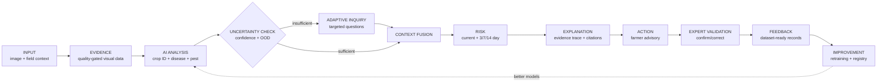

**The product feels like an intelligent agricultural early-warning assistant — never "just another plant disease classifier."**

---

*End of Blueprint. Companion detail: docs/01–22. FasalRakshak — Scan. Predict. Protect.*
