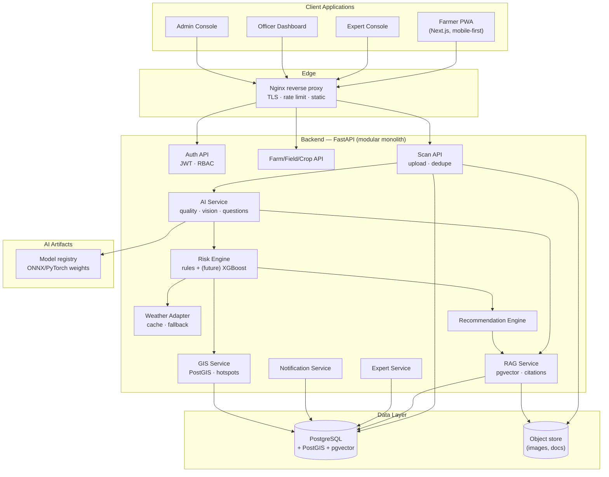

# 04 · System Architecture

Status: architecture overview; component-by-component rationale. Detailed module internals: docs 05/06/09/10/11.

## 1. High-Level Architecture

## 2. Architectural Decisions

| Decision | Choice | Why | Alternatives rejected | Limitations |
|---|---|---|---|---|
| AD-1 | **Modular monolith** (FastAPI) with hard module boundaries [PROPOSED DESIGN] | Student team; one deployable; modules can be extracted to services later without rewrites | Microservices from day 1 (ops overhead, fake complexity) | Vertical scaling only until extraction |
| AD-2 | **PostgreSQL + PostGIS + pgvector** as the single database [ARCHITECT INFERENCE] | Relational core + geospatial + vectors in one system; fewer moving parts | Postgres + separate Pinecone/Milvus/Chroma (extra service to run/secure) | Vector scale limits (fine ≤ ~1M chunks for our corpus) |
| AD-3 | **CPU-first inference** (PyTorch/ONNX Runtime), GPU optional [PROPOSED DESIGN] | SIH budget; nano models are fast enough on CPU | GPU-required stack | Larger models later need GPU tier |
| AD-4 | **PWA**, not native app [PROPOSED DESIGN] | Installable, offline-capable, one codebase, fast iteration | React Native/Flutter (app-store friction for a hackathon) | Some native-only features (background SMS) |
| AD-5 | **Nginx + Docker Compose** [ARCHITECT INFERENCE] | Reproducible on any laptop/VPS; demo-able offline | Kubernetes (overkill) | Single-node HA limits |
| AD-6 | **Server-rendered-ish PWA + REST** | Simple, cache-friendly, works on weak networks | BFF + GraphQL | — |
| AD-7 | **Postgres-based queues** (simple job rows + worker loop) at MVP | No Redis dependency for demo; upgrade path to Redis/RQ documented | Redis+Celery from day 1 | Lower throughput; adequate for pilot volume |

## 3. Component Responsibilities

| Component | Responsibility | Key contracts |
|---|---|---|
| Auth API | Registration, login, JWT issue/refresh, RBAC guards | `POST /api/v1/auth/*` |
| Farm/Field/Crop API | CRUD for farms, fields (GPS), crops, crop cycles | `/api/v1/farms|fields|crops` |
| Scan API | Scan creation, image storage, dedupe, history | `/api/v1/scans` |
| AI Service | Quality gate → crop ID → disease/pest inference → confidence/OOD → explainability → question generation | `/api/v1/ai/*` |
| Risk Engine | Evidence + context → current/3/7/14 risk, drivers, escalation | `/api/v1/risk/*` |
| Weather Adapter | Provider abstraction, cache, validation, fallback | `/api/v1/weather/{field_id}` |
| GIS Service | Spatial storage, heatmap aggregation, hotspot clustering | `/api/v1/gis/*` |
| RAG Service | Ingest docs, chunk, embed, retrieve, cite | internal + `/api/v1/knowledge` |
| Recommendation Engine | Assemble advisory from retrieved chunks + templates + i18n | embedded in diagnosis response |
| Expert Service | Queue management, review workflow, feedback capture | `/api/v1/expert/*` |
| Notification Service | Severity rules, dedupe, channel dispatch | `/api/v1/notifications` |
| Admin API | Users, KB ingestion, model registry, config | `/api/v1/admin/*` |

## 4. Data Flow Summary (full detail: docs/13)

- **Scan flow:** client → Scan API → object store → AI Service (quality → vision → confidence) → Risk Engine (weather + context) → Recommendation (RAG) → response persisted → notification rules.
- **Inquiry flow:** low confidence → question bank selection → client renders → answers stored → AI re-runs fusion → updated result.
- **Surveillance flow:** verified/reported events → GIS aggregation → hotspot candidates → officer alerts → interventions.
- **Learning flow:** expert verdicts + farmer feedback → dataset manifest export → (offline) retraining → model registry → canary rollout.

## 5. Why this satisfies the brief's expected shape
The brief's sketch (Farmer App + Officer Portal → API Gateway → Backend → Auth/Crop/AI/Risk → PostgreSQL/PostGIS → Weather/RAG/GIS → Recommendation → Advisory → Expert Validation → Feedback) maps 1:1 onto the components above; improvements are: explicit image-quality stage, pgvector-in-Postgres instead of a separate vector DB, object storage for images, a dedicated notification service with anti-spam, and CPU-first deployment [ARCHITECT INFERENCE].
