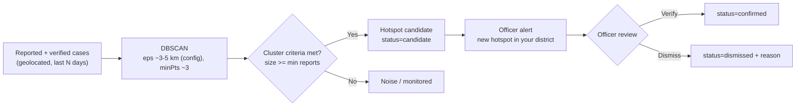
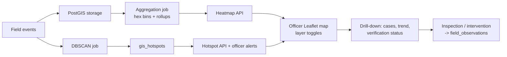

# 09 · GIS Architecture

Spatial intelligence for FasalRakshak: where are problems, where are they heading, and what should officers do? Stack: **PostGIS** (authoritative storage + analytics) + **Leaflet + OpenStreetMap** (rendering; Mapbox optional later). [ARCHITECT INFERENCE; SOURCE-DERIVED feature list]

## 1. Data Foundations

- `fields.location geography(Point,4326)` — captured at registration (auto-GPS) or manual pin; GIST-indexed.
- `disease_reports` / `pest_reports` — each tied to a field; carries `source` (farmer|ai|expert|officer) and `status` (**reported | ai_predicted | expert_verified | rejected**).
- `gis_hotspots` — cluster artifacts (centroid, size, trend, status candidate/confirmed/dismissed, parameters).
- `weather_observations` — joined for weather-correlated regional views **[P2]**.
- `regions` boundary table (district/block polygons) **[P2]** for rollups.

## 2. Layers (semantic separation — non-negotiable [SOURCE-DERIVED])

| Layer | Source | Visual encoding | Label on UI |
|---|---|---|---|
| Reported cases | farmer reports + AI-flagged scans (unverified) | amber circle markers | "Reported (unverified)" |
| Expert-verified cases | expert verdicts | green/dark markers | "Verified" |
| AI-predicted risk | risk engine per field | blue-purple heatmap | "AI prediction" |
| Hotspots | DBSCAN over reported/verified | pulsing red outlines | "Hotspot candidate" |

Rule: predicted-risk layers are **never** styled like confirmed outbreaks; tooltips always state verification status. This prevents map-induced panic and false "outbreak" claims.

## 3. Heatmap & Aggregation

- Hex-grid (or ST_SnapToGrid) aggregation per district, computed by a **background job** into materialized tables; API serves aggregates (fast, cheap).
- Intensity = f(count of events weighted by verification status and recency) — weighting function documented and versioned (prototype weights) [PROPOSED DESIGN].
- Time slider (from/to) enables historical comparison **[P2]**.

## 4. Hotspot Detection (DBSCAN — used only where appropriate)

**Why DBSCAN here:** unknown number of clusters, arbitrary shapes, natural noise handling — ideal for case clustering. **Where NOT:** never on AI-predicted risk values (those are continuous fields rendered as heatmaps, not cluster events). eps/minPts are config with defaults documented as prototype parameters.

## 5. APIs (see docs/08 §6)

`GET /api/v1/gis/heatmap` (cells + intensity + source tag) · `GET /api/v1/gis/hotspots` (list) · `GET /api/v1/gis/hotspots/{id}/cases` (drill-down) · district rollups via officer dashboard endpoint.

## 6. Officer Map UX

Base: OSM tiles (attribution required). Controls: district filter, threat filter (disease/pest), time range, layer toggles (reported/verified/predicted/hotspots). Hotspot click → popup with location · crop · threat · report count · risk · trend · last update · recommended intervention · **verification status** → "View cases" → drill-down.

## 7. Privacy in GIS

Farmer identities never rendered on officer maps (pseudonymized field refs); exact coordinates visible only to audited roles; aggregate views default; docs/31 governs.

## 8. Limitations (honest)

GPS accuracy on cheap phones (±10–50 m) is fine for district analytics, not for intra-field mapping; DBSCAN parameters need regional tuning; low report density → sparse early hotspots (mitigate via officer verification loops); OSM tiles require connectivity (cached for demo).
