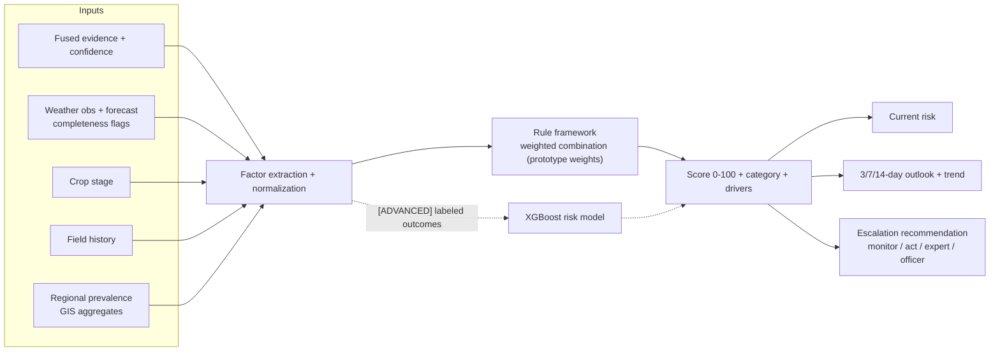

# 10 · Risk Engine

The risk engine converts fused evidence into decisions. Core principle [SOURCE-DERIVED]: **risk ≠ confidence.** Status: [PROPOSED DESIGN — transparent rule framework with explicitly labeled prototype weights; XGBoost refinement is ADVANCED].

## 1. Three Separable Quantities

| Quantity | Question | Example | Owner |
|---|---|---|---|
| Diagnosis Confidence | How sure is the AI about identity? | 89% early blight | AI layer |
| Disease/Pest Risk (current) | How significant is the threat now? | Medium (48/100) | Risk engine |
| Escalation Risk (3/7/14 d) | Will it worsen? | 7-day High (67/100) | Risk engine |

Why separate: a high-confidence minor cosmetic issue = Low risk; a low-confidence sighting during highly favorable weather = High risk. Conflating them would produce wrong advice; keeping them separate produces the brief's example exactly: confidence 89% · current Medium · 7-day High.

## 2. Inputs

Visual evidence (labels + calibrated confidence + quality reliability) · farmer answers · weather (observed + forecast, with completeness flags) · crop stage · crop type · field history (previous scans/observations/reports) · regional prevalence (reported/verified aggregate signals) · soil/IoT where available **[FUTURE FEATURE]**.

## 3. Factor Model

`Risk = 100 × Σ wᵢ·fᵢ` with factors normalized 0–1:

| Factor fᵢ | Default weight wᵢ (prototype) | Derivation |
|---|---|---|
| Evidence strength | 0.30 | fused posterior of top hypothesis × image-quality reliability |
| Weather suitability | 0.25 | rule set per threat from knowledge base (cited) or generic agronomic heuristics (lower weight) |
| Stage susceptibility | 0.15 | crop-stage susceptibility table (knowledge base / config) |
| History pressure | 0.15 | previous field cases within N days; recurrence flags |
| Regional pressure | 0.10 | district-level reported/verified counts (GIS aggregates) |
| Spread potential | 0.05 | pest mobility / airborne pathogen class from knowledge base |

**Weights are PROTOTYPE WEIGHTS** [PROPOSED DESIGN] — stored in versioned config, surfaced in the UI ("how risk was computed"), never presented as scientifically validated. Where the knowledge base provides cited condition rules (e.g., humidity/leaf-wetness favoring fungal pressure), they are used with citation; otherwise generic heuristics apply at reduced weight. No invented pathogen-specific thresholds.

## 4. Scoring & Categories

- Score 0–100 → **Low 0–24 · Medium 25–49 · High 50–74 · Critical 75–100** (config).
- Missing input handling: factor absent → weight redistributed + `weather_completeness`/data-gap flags returned; risk confidence shown ("weather unknown" state) — **never silent imputation**.

## 5. Outlook (3/7/14-day)

Outlook = current score recomputed with **forecast** weather + threat progression priors (incubation/spread characteristics from knowledge base, cited where available) + expected lifecycle effects. Trend (rising/stable/declining) from score deltas; forecast-confidence badge degrades with horizon.

## 6. Escalation Logic

| Condition | Recommendation |
|---|---|
| Risk Low + confidence High | Routine monitoring reminder |
| Risk Medium | Monitoring plan + advisory steps |
| Risk High | Immediate advisory + expert-review flag |
| Risk Critical OR (High + verified cluster nearby) | Officer-visible alert + hotspot candidate feed |
| Insufficient evidence + High weather suitability | Questions + conservative "watch closely" advice + expert flag |

## 7. Worked Example (illustrative arithmetic, prototype weights)

Fused posterior for early blight = 0.89; image quality Good (reliability 1.0) → **Evidence = 0.89**.
Weather: rain last 72 h + RH > 80% forecast (rule: strongly favorable, cited) → **Weather = 0.85**.
Stage: fruiting (susceptible) → **Stage = 0.7**. History: no prior cases in 30 days → **History = 0.1**. Regional: 2 verified cases district-wide → **Regional = 0.3**. Spread: airborne (cited) → **Spread = 0.6**.

`Risk = 100 × (0.30×0.89 + 0.25×0.85 + 0.15×0.7 + 0.15×0.1 + 0.10×0.3 + 0.05×0.6)`
`= 100 × (0.267 + 0.2125 + 0.105 + 0.015 + 0.03 + 0.03) = 100 × 0.6595 ≈ **66 → High**` ✓ matches the brief's "current Medium / 7-day High" style outcome when forecast weather worsens (outlook recomputation raises weather factor → 7-day ≈ 72, High).

**Explanation shown to farmer (localized):** "Risk is HIGH mainly because: recent rain + humid forecast (strongest factor), the crop is in a susceptible stage, and the disease is identified with high confidence." Driver attribution = normalized wᵢ·fᵢ contributions, top-3 displayed.

## 8. Calibration & Governance

- **Outcome tracking:** expert verdicts + follow-up scans vs predicted risk → precision/recall of HIGH+ risk events (docs/17); drift triggers weight review.
- **Versioned rulesets:** `risk_ruleset` version recorded in every `risk_predictions.model_ref`; changes diffed in git.
- **XGBoost path [ADVANCED]:** when ≥ labeled outcome corpus exists, gradient-boosted model refines weights; rules remain as guardrail/fallback; SHAP-style factor attribution preserves explainability.
- **Non-goals:** we do not claim epidemiological validity; we provide a *transparent, tunable, explainable* decision-support score with cited condition rules.

## 9. API Surface

`GET /api/v1/risk/{field_id}?horizon=3|7|14` (docs/08 §5) returns score, category, factors (named + contribution), trend, weather_completeness, model_ref. Risk is embedded in every diagnosis response as well.

---
