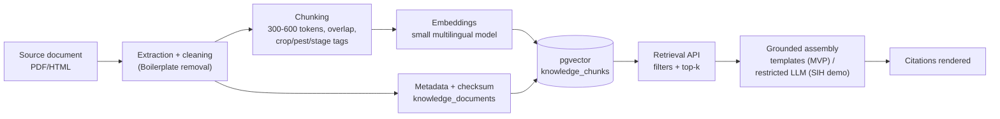

# 11 · RAG Knowledge System

Grounding every recommendation in verifiable sources. [SOURCE-DERIVED requirement; PROPOSED DESIGN implementation]

## 1. Knowledge Sources (publicly available material only)

ICAR institutes & NCIPM guidance · state agricultural university packages of practices · Directorate of Plant Protection (DPPQS) advisories & NPSS framing [SOURCE-DERIVED concept] · FAO/IPM resources · KVK materials. Each document ingested with metadata: title, publisher, year, URL, language, doc_type.

## 2. Ingestion Pipeline

Details: semantic chunking with 15–20% overlap; tags (crop codes, disease/pest codes, stage applicability, region) extracted at ingestion; HNSW index; embeddings dimension fixed per model (e.g., 384) and versioned — **re-embedding required on model change** (documented migration job).

## 3. Retrieval

Query construction from the fused diagnosis (crop + threat code + stage + region + locale); filters first (hard constraints), then similarity top-k (k=3–6); cross-lingual retrieval via multilingual embeddings (Hindi query → English source chunk); scores + sources returned for citation rendering. Empty retrieval → advisory built from **generic safe guidance only** ("monitor, consult your KVK/agriculture officer") with explicit "no specific verified guidance found in knowledge base" note — **never generated specifics**.

## 4. Grounded Generation (anti-hallucination architecture)

- **MVP: template-first.** Deterministic localized templates select and order retrieved guidance snippets. Fully auditable — output = f(retrieved chunks + template version).
- **SIH demo: restricted LLM rephrase.** An LLM may rephrase **only the retrieved chunks**, with citation keys preserved, and must refuse when retrieval is empty; prompt-injection-resistant (chunks are data, never instructions); temperature 0; output validated against source-citation invariants.
- **Prohibited:** free generation of dosages, brand names, chemical schedules; invented condition thresholds; unverifiable claims. Pesticide content appears only as stated by verified sources, with safety note + "consult local agriculture officer/KVK" [SOURCE-DERIVED].
- **Every recommendation carries:** source title + publisher + year (+URL), applicability (crop/region/stage), safety note, applicability tag. `recommendations.sources` JSONB preserves chunk references for audit.

## 5. Quality Assurance

Source allowlist; ingestion checksums (dedupe); reviewer workflow for new documents (admin + expert); chunk spot-check sampling; retrieval eval set (query → expected chunk) with hit-rate metric reported in docs/17.

